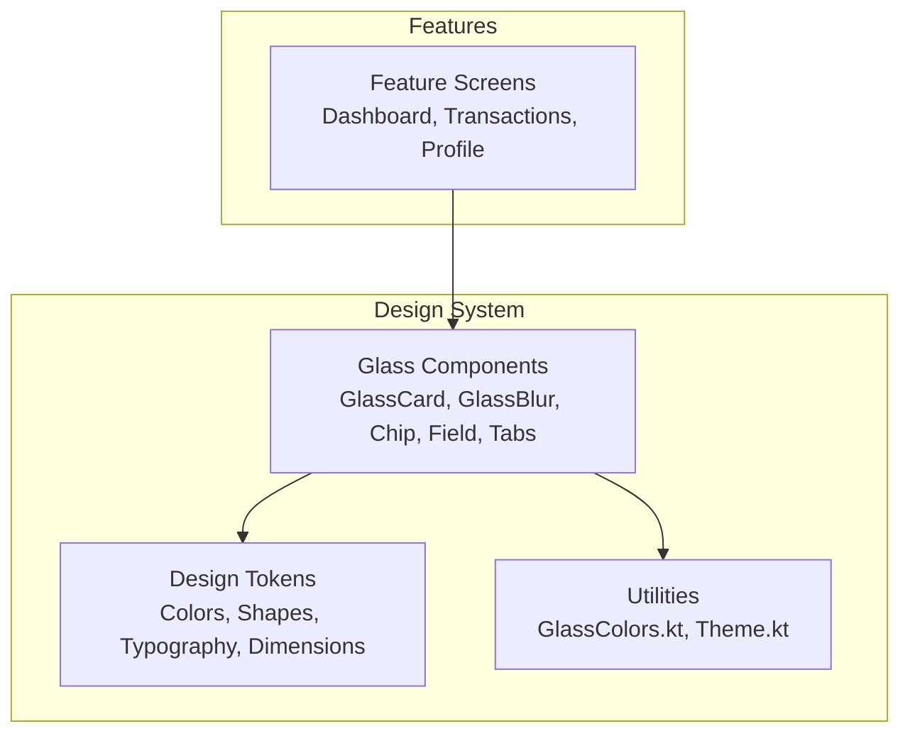
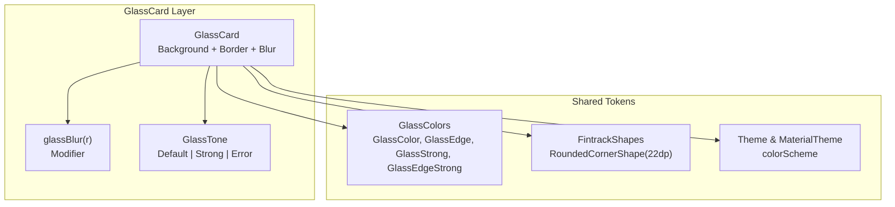
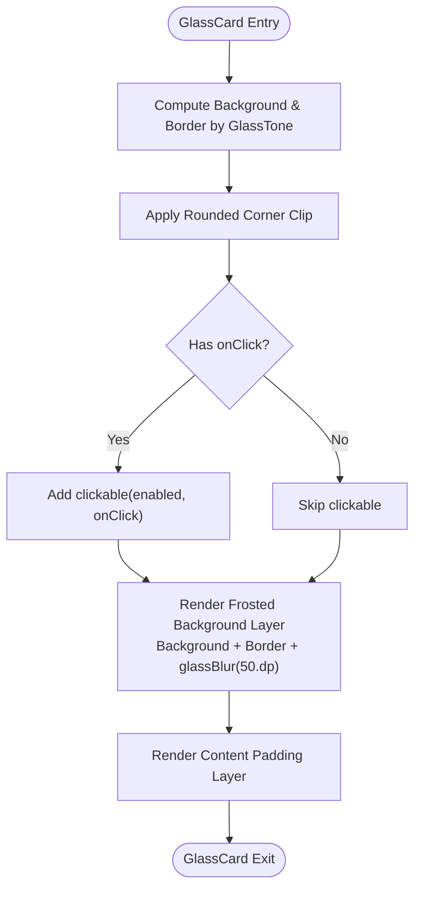
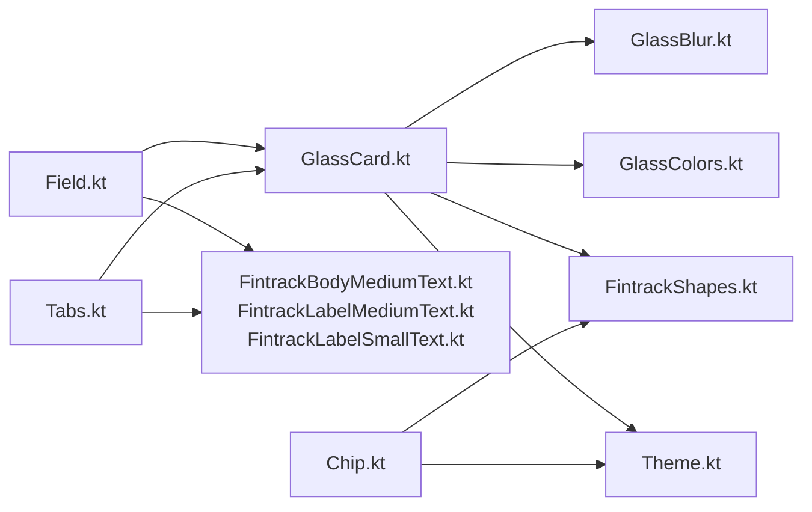

# Glassmorphism Components

<cite>
**Referenced Files in This Document**
- [GlassCard.kt](file://core/designsystem/src/commonMain/kotlin/com/kazemieh/designsystem/component/glass/GlassCard.kt)
- [GlassBlur.kt](file://core/designsystem/src/commonMain/kotlin/com/kazemieh/designsystem/component/glass/GlassBlur.kt)
- [Chip.kt](file://core/designsystem/src/commonMain/kotlin/com/kazemieh/designsystem/component/glass/Chip.kt)
- [Field.kt](file://core/designsystem/src/commonMain/kotlin/com/kazemieh/designsystem/component/glass/Field.kt)
- [Tabs.kt](file://core/designsystem/src/commonMain/kotlin/com/kazemieh/designsystem/component/glass/Tabs.kt)
- [GlassColors.kt](file://core/designsystem/src/commonMain/kotlin/com/kazemieh/designsystem/GlassColors.kt)
- [Theme.kt](file://core/designsystem/src/commonMain/kotlin/com/kazemieh/designsystem/Theme.kt)
- [Color.kt](file://core/designsystem/src/commonMain/kotlin/com/kazemieh/designsystem/Color.kt)
- [Dimensions.kt](file://core/designsystem/src/commonMain/kotlin/com/kazemieh/designsystem/Dimensions.kt)
- [FintrackOutlinedTextField.kt](file://core/designsystem/src/commonMain/kotlin/com/kazemieh/designsystem/component/FintrackOutlinedTextField.kt)
- [FintrackBodyMediumText.kt](file://core/designsystem/src/commonMain/kotlin/com/kazemieh/designsystem/component/FintrackBodyMediumText.kt)
- [FintrackLabelMediumText.kt](file://core/designsystem/src/commonMain/kotlin/com/kazemieh/designsystem/component/FintrackLabelMediumText.kt)
- [FintrackLabelSmallText.kt](file://core/designsystem/src/commonMain/kotlin/com/kazemieh/designsystem/component/FintrackLabelSmallText.kt)
- [FintrackShapes.kt](file://core/designsystem/src/commonMain/kotlin/com/kazemieh/designsystem/FintrackShapes.kt)
- [FintrackTypography.kt](file://core/designsystem/src/commonMain/kotlin/com/kazemieh/designsystem/FintrackTypography.kt)
- [build.gradle.kts](file://core/designsystem/build.gradle.kts)
</cite>

## Table of Contents
1. [Introduction](#introduction)
2. [Project Structure](#project-structure)
3. [Core Components](#core-components)
4. [Architecture Overview](#architecture-overview)
5. [Detailed Component Analysis](#detailed-component-analysis)
6. [Dependency Analysis](#dependency-analysis)
7. [Performance Considerations](#performance-considerations)
8. [Troubleshooting Guide](#troubleshooting-guide)
9. [Conclusion](#conclusion)
10. [Appendices](#appendices)

## Introduction
This document provides comprehensive documentation for FinTrack's glassmorphism UI components, focusing on the frosted glass effect implementation. It explains the GlassCard, GlassBlur, Chip, Field, and Tabs components, detailing their visual properties, interaction behaviors, styling options, and integration patterns within the design system. It also covers backdrop blur techniques, transparency handling across platforms, performance considerations, platform-specific implementations, accessibility features, and design best practices for effective glass usage.

## Project Structure
The glass components are part of the design system module and are implemented using Jetpack Compose. They rely on shared design tokens (colors, shapes, typography) and are integrated into feature screens via composables.

**Diagram sources**
- [GlassCard.kt:1-73](file://core/designsystem/src/commonMain/kotlin/com/kazemieh/designsystem/component/glass/GlassCard.kt#L1-L73)
- [GlassBlur.kt:1-20](file://core/designsystem/src/commonMain/kotlin/com/kazemieh/designsystem/component/glass/GlassBlur.kt#L1-L20)
- [Chip.kt:1-54](file://core/designsystem/src/commonMain/kotlin/com/kazemieh/designsystem/component/glass/Chip.kt#L1-L54)
- [Field.kt:1-76](file://core/designsystem/src/commonMain/kotlin/com/kazemieh/designsystem/component/glass/Field.kt#L1-L76)
- [Tabs.kt:1-102](file://core/designsystem/src/commonMain/kotlin/com/kazemieh/designsystem/component/glass/Tabs.kt#L1-L102)
- [GlassColors.kt](file://core/designsystem/src/commonMain/kotlin/com/kazemieh/designsystem/GlassColors.kt)
- [Theme.kt](file://core/designsystem/src/commonMain/kotlin/com/kazemieh/designsystem/Theme.kt)
- [Color.kt](file://core/designsystem/src/commonMain/kotlin/com/kazemieh/designsystem/Color.kt)
- [Dimensions.kt](file://core/designsystem/src/commonMain/kotlin/com/kazemieh/designsystem/Dimensions.kt)

**Section sources**
- [build.gradle.kts:50-76](file://core/designsystem/build.gradle.kts#L50-L76)

## Core Components
This section introduces the five glass components and their primary roles in FinTrack’s UI.

- GlassCard: Base container with frosted glass background, rounded corners, optional click handling, and padding. Supports three tones: Default, Strong, and Error.
- GlassBlur: Utility modifier that applies a blur effect using Compose’s blur implementation.
- Chip: Selectable pill-shaped element with optional dashed border, click and long-click support, and active state styling.
- Field: Form row built on GlassCard, displaying label, optional required marker, optional hint, and child content area.
- Tabs: Segmented tab control built on GlassCard, animating background and text color transitions, and optional count badges.

**Section sources**
- [GlassCard.kt:18-72](file://core/designsystem/src/commonMain/kotlin/com/kazemieh/designsystem/component/glass/GlassCard.kt#L18-L72)
- [GlassBlur.kt:9-19](file://core/designsystem/src/commonMain/kotlin/com/kazemieh/designsystem/component/glass/GlassBlur.kt#L9-L19)
- [Chip.kt:18-54](file://core/designsystem/src/commonMain/kotlin/com/kazemieh/designsystem/component/glass/Chip.kt#L18-L54)
- [Field.kt:17-76](file://core/designsystem/src/commonMain/kotlin/com/kazemieh/designsystem/component/glass/Field.kt#L17-L76)
- [Tabs.kt:26-102](file://core/designsystem/src/commonMain/kotlin/com/kazemieh/designsystem/component/glass/Tabs.kt#L26-L102)

## Architecture Overview
The glass components are layered on top of shared design tokens and utilities. GlassCard orchestrates the frosted glass effect by combining a semi-transparent background, a thin border, and a blur modifier. Supporting utilities and tokens provide consistent colors, shapes, and typography.

**Diagram sources**
- [GlassCard.kt:31-61](file://core/designsystem/src/commonMain/kotlin/com/kazemieh/designsystem/component/glass/GlassCard.kt#L31-L61)
- [GlassBlur.kt:14-19](file://core/designsystem/src/commonMain/kotlin/com/kazemieh/designsystem/component/glass/GlassBlur.kt#L14-L19)
- [GlassColors.kt](file://core/designsystem/src/commonMain/kotlin/com/kazemieh/designsystem/GlassColors.kt)
- [FintrackShapes.kt](file://core/designsystem/src/commonMain/kotlin/com/kazemieh/designsystem/FintrackShapes.kt)
- [Theme.kt](file://core/designsystem/src/commonMain/kotlin/com/kazemieh/designsystem/Theme.kt)

## Detailed Component Analysis

### GlassCard
GlassCard is the foundational glass surface. It:
- Computes background and border colors based on the selected GlassTone.
- Clips to rounded corners and optionally enables clickable behavior.
- Renders a frosted background layer using a semi-transparent surface color and a blur modifier.
- Provides a sharp content layer with configurable padding.

Key implementation aspects:
- Uses Material color scheme for Default and Error tones; custom glass colors for Strong tone.
- Applies a blur radius tuned to 50.dp for the preferred frosted effect.
- Integrates clickable behavior with enabled state alpha adjustment.

**Diagram sources**
- [GlassCard.kt:22-68](file://core/designsystem/src/commonMain/kotlin/com/kazemieh/designsystem/component/glass/GlassCard.kt#L22-L68)

**Section sources**
- [GlassCard.kt:18-72](file://core/designsystem/src/commonMain/kotlin/com/kazemieh/designsystem/component/glass/GlassCard.kt#L18-L72)

### GlassBlur
GlassBlur is a utility modifier that applies a blur effect. It:
- Wraps Compose’s blur modifier for cross-platform compatibility.
- Accepts a configurable blur radius with a default value suitable for glass surfaces.

Platform note:
- Works on Skia-based platforms (JVM/Skia) in Compose Multiplatform.

**Section sources**
- [GlassBlur.kt:9-19](file://core/designsystem/src/commonMain/kotlin/com/kazemieh/designsystem/component/glass/GlassBlur.kt#L9-L19)

### Chip
Chip provides a pill-shaped interactive element:
- Active state uses a translucent background and bordered outline.
- Supports click and optional long-click callbacks.
- Uses a very high rounded corner shape for pill appearance.

Integration pattern:
- Often used inside Field or standalone for selection controls.

**Section sources**
- [Chip.kt:18-54](file://core/designsystem/src/commonMain/kotlin/com/kazemieh/designsystem/component/glass/Chip.kt#L18-L54)

### Field
Field is a form row built on GlassCard:
- Displays a label with optional required marker and optional hint.
- Supports an error state with red accents.
- Wraps child content for flexible form controls (e.g., text fields).

Usage pattern:
- Frequently used with FinTrack text components and form controls.

**Section sources**
- [Field.kt:17-76](file://core/designsystem/src/commonMain/kotlin/com/kazemieh/designsystem/component/glass/Field.kt#L17-L76)

### Tabs
Tabs is a segmented control built on GlassCard:
- Each tab animates background and text color transitions on selection.
- Optional count badges with lightweight background and subdued text.
- Responsive layout using weights and spacing.

Accessibility note:
- Ensure sufficient touch target size and contrast for selected/unselected states.

**Section sources**
- [Tabs.kt:26-102](file://core/designsystem/src/commonMain/kotlin/com/kazemieh/designsystem/component/glass/Tabs.kt#L26-L102)

## Dependency Analysis
The glass components depend on shared design tokens and utilities. The following diagram shows key dependencies:

**Diagram sources**
- [GlassCard.kt:1-73](file://core/designsystem/src/commonMain/kotlin/com/kazemieh/designsystem/component/glass/GlassCard.kt#L1-L73)
- [GlassBlur.kt:1-20](file://core/designsystem/src/commonMain/kotlin/com/kazemieh/designsystem/component/glass/GlassBlur.kt#L1-L20)
- [GlassColors.kt](file://core/designsystem/src/commonMain/kotlin/com/kazemieh/designsystem/GlassColors.kt)
- [FintrackShapes.kt](file://core/designsystem/src/commonMain/kotlin/com/kazemieh/designsystem/FintrackShapes.kt)
- [Theme.kt](file://core/designsystem/src/commonMain/kotlin/com/kazemieh/designsystem/Theme.kt)
- [Field.kt:1-76](file://core/designsystem/src/commonMain/kotlin/com/kazemieh/designsystem/component/glass/Field.kt#L1-L76)
- [Tabs.kt:1-102](file://core/designsystem/src/commonMain/kotlin/com/kazemieh/designsystem/component/glass/Tabs.kt#L1-L102)
- [Chip.kt:1-54](file://core/designsystem/src/commonMain/kotlin/com/kazemieh/designsystem/component/glass/Chip.kt#L1-L54)
- [FintrackBodyMediumText.kt](file://core/designsystem/src/commonMain/kotlin/com/kazemieh/designsystem/component/FintrackBodyMediumText.kt)
- [FintrackLabelMediumText.kt](file://core/designsystem/src/commonMain/kotlin/com/kazemieh/designsystem/component/FintrackLabelMediumText.kt)
- [FintrackLabelSmallText.kt](file://core/designsystem/src/commonMain/kotlin/com/kazemieh/designsystem/component/FintrackLabelSmallText.kt)

**Section sources**
- [GlassCard.kt:31-61](file://core/designsystem/src/commonMain/kotlin/com/kazemieh/designsystem/component/glass/GlassCard.kt#L31-L61)
- [Field.kt:30-74](file://core/designsystem/src/commonMain/kotlin/com/kazemieh/designsystem/component/glass/Field.kt#L30-L74)
- [Tabs.kt:37-99](file://core/designsystem/src/commonMain/kotlin/com/kazemieh/designsystem/component/glass/Tabs.kt#L37-L99)
- [Chip.kt:32-47](file://core/designsystem/src/commonMain/kotlin/com/kazemieh/designsystem/component/glass/Chip.kt#L32-L47)

## Performance Considerations
- Blur cost: The blur modifier adds rendering overhead. Prefer conservative blur radii (as implemented) and avoid excessive nesting of blurred containers.
- Transparency and blending: Semi-transparent backgrounds combined with blur can increase overdraw. Keep glass surfaces shallow and avoid deep hierarchies.
- Clickable overlays: Use minimal clickable areas and avoid overlapping clickable regions to reduce recompositions.
- Platform differences: On lower-end devices, consider reducing blur intensity or disabling blur for non-critical surfaces. Test on real devices to validate smoothness.
- Animation budget: Tabs animate background and text colors; keep animations short and avoid heavy content inside tabs.

[No sources needed since this section provides general guidance]

## Troubleshooting Guide
Common issues and resolutions:
- Blur not visible:
  - Ensure the blur modifier is applied after background and border to achieve the intended frosted look.
  - Verify that the background color has sufficient translucency for the blur effect to show.
- Low contrast in active states:
  - Adjust active background alpha and border opacity to meet accessibility contrast requirements.
- Touch target too small:
  - Increase padding and minimum hit area for chips and tabs to improve usability.
- Text readability:
  - Use appropriate text colors from the design tokens and maintain sufficient contrast against the glass background.

**Section sources**
- [GlassCard.kt:54-61](file://core/designsystem/src/commonMain/kotlin/com/kazemieh/designsystem/component/glass/GlassCard.kt#L54-L61)
- [Chip.kt:32-47](file://core/designsystem/src/commonMain/kotlin/com/kazemieh/designsystem/component/glass/Chip.kt#L32-L47)
- [Tabs.kt:47-54](file://core/designsystem/src/commonMain/kotlin/com/kazemieh/designsystem/component/glass/Tabs.kt#L47-L54)

## Conclusion
FinTrack’s glassmorphism components provide a cohesive, visually appealing set of UI primitives that balance aesthetics and performance. By leveraging shared design tokens, consistent shapes, and thoughtful interaction patterns, the components integrate seamlessly across platforms. Following the best practices outlined here ensures optimal user experience while maintaining performance and accessibility standards.

[No sources needed since this section summarizes without analyzing specific files]

## Appendices

### Visual Properties and Styling Options
- GlassCard
  - Tones: Default (surfaceVariant), Strong (custom strong glass), Error (errorContainer).
  - Padding: Configurable dp value.
  - Interactions: Optional enabled state and click handler.
- GlassBlur
  - Radius: Configurable Dp with default optimized for glass.
- Chip
  - Active state: Translucent background and bordered outline.
  - Borders: Solid or dashed.
  - Interactions: Click and optional long-click.
- Field
  - Label: Required marker and hint support.
  - Error state: Red accent colors.
  - Child content: Flexible composition slot.
- Tabs
  - Selection animation: Background and text color transitions.
  - Count badges: Lightweight indicators with alpha blending.

**Section sources**
- [GlassCard.kt:22-68](file://core/designsystem/src/commonMain/kotlin/com/kazemieh/designsystem/component/glass/GlassCard.kt#L22-L68)
- [GlassBlur.kt:14-19](file://core/designsystem/src/commonMain/kotlin/com/kazemieh/designsystem/component/glass/GlassBlur.kt#L14-L19)
- [Chip.kt:23-52](file://core/designsystem/src/commonMain/kotlin/com/kazemieh/designsystem/component/glass/Chip.kt#L23-L52)
- [Field.kt:21-74](file://core/designsystem/src/commonMain/kotlin/com/kazemieh/designsystem/component/glass/Field.kt#L21-L74)
- [Tabs.kt:30-100](file://core/designsystem/src/commonMain/kotlin/com/kazemieh/designsystem/component/glass/Tabs.kt#L30-L100)

### Integration Patterns
- Use GlassCard as the base container for any glass surface requiring a frosted background.
- Wrap form controls inside Field to inherit consistent spacing and typography.
- Use Tabs for segmented navigation within constrained spaces.
- Use Chip for quick selections and removable items.

**Section sources**
- [Field.kt:30-74](file://core/designsystem/src/commonMain/kotlin/com/kazemieh/designsystem/component/glass/Field.kt#L30-L74)
- [Tabs.kt:37-99](file://core/designsystem/src/commonMain/kotlin/com/kazemieh/designsystem/component/glass/Tabs.kt#L37-L99)
- [Chip.kt:23-52](file://core/designsystem/src/commonMain/kotlin/com/kazemieh/designsystem/component/glass/Chip.kt#L23-L52)

### Accessibility Features
- Contrast: Ensure sufficient contrast between text and the frosted background using the provided text color tokens.
- Focus: Provide visible focus indicators for interactive elements inside glass surfaces.
- Touch targets: Maintain minimum touch target sizes for chips and tabs.
- Motion: Keep animations subtle and avoid unnecessary motion for users sensitive to movement.

**Section sources**
- [GlassCard.kt:44-46](file://core/designsystem/src/commonMain/kotlin/com/kazemieh/designsystem/component/glass/GlassCard.kt#L44-L46)
- [Tabs.kt:47-54](file://core/designsystem/src/commonMain/kotlin/com/kazemieh/designsystem/component/glass/Tabs.kt#L47-L54)
- [Chip.kt:38-41](file://core/designsystem/src/commonMain/kotlin/com/kazemieh/designsystem/component/glass/Chip.kt#L38-L41)