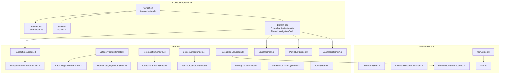
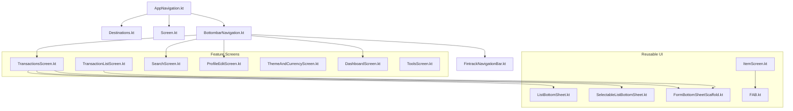
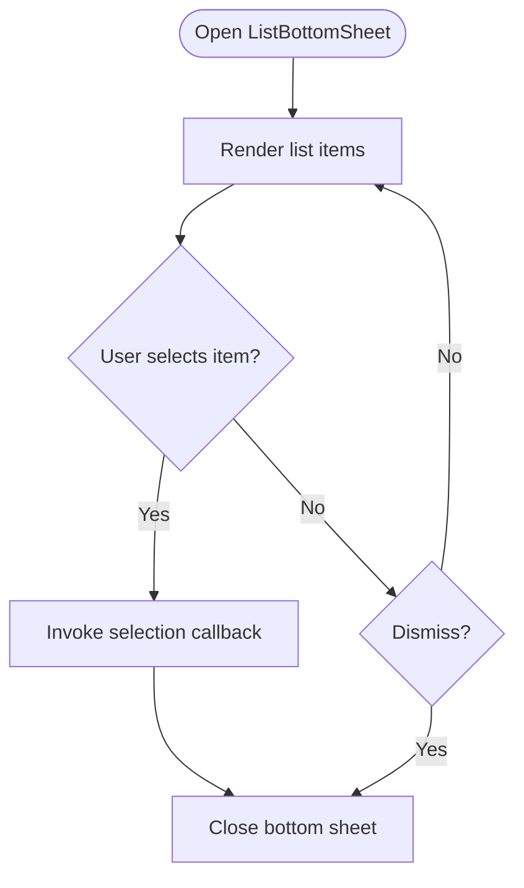
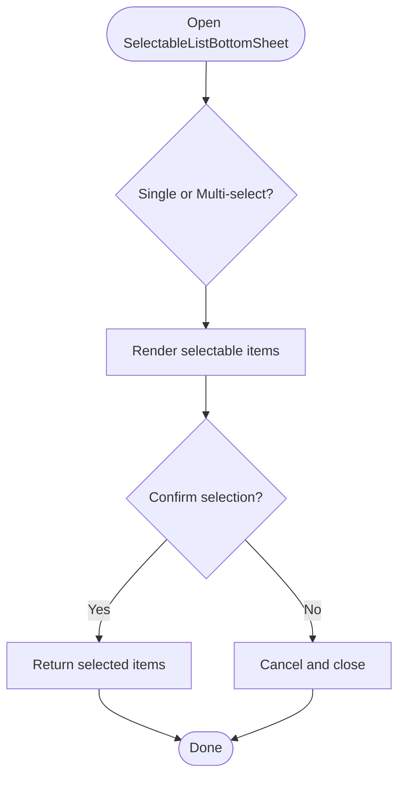
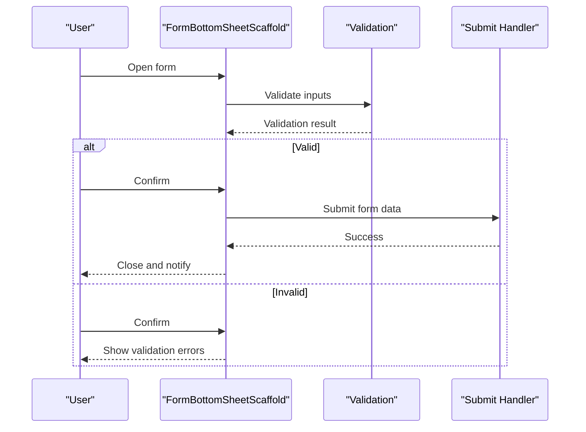
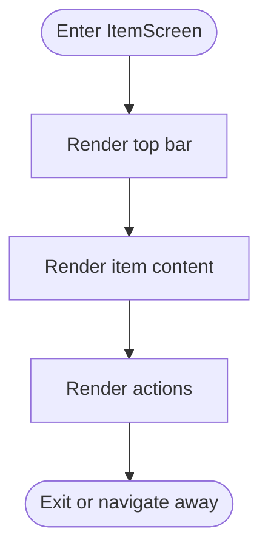
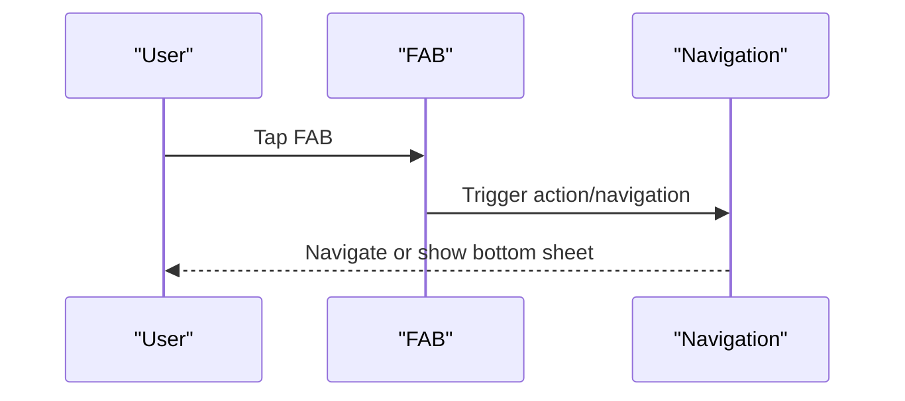
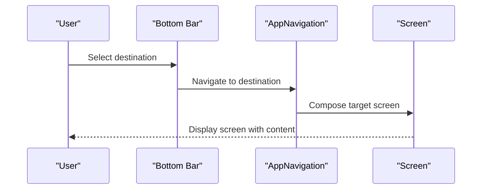
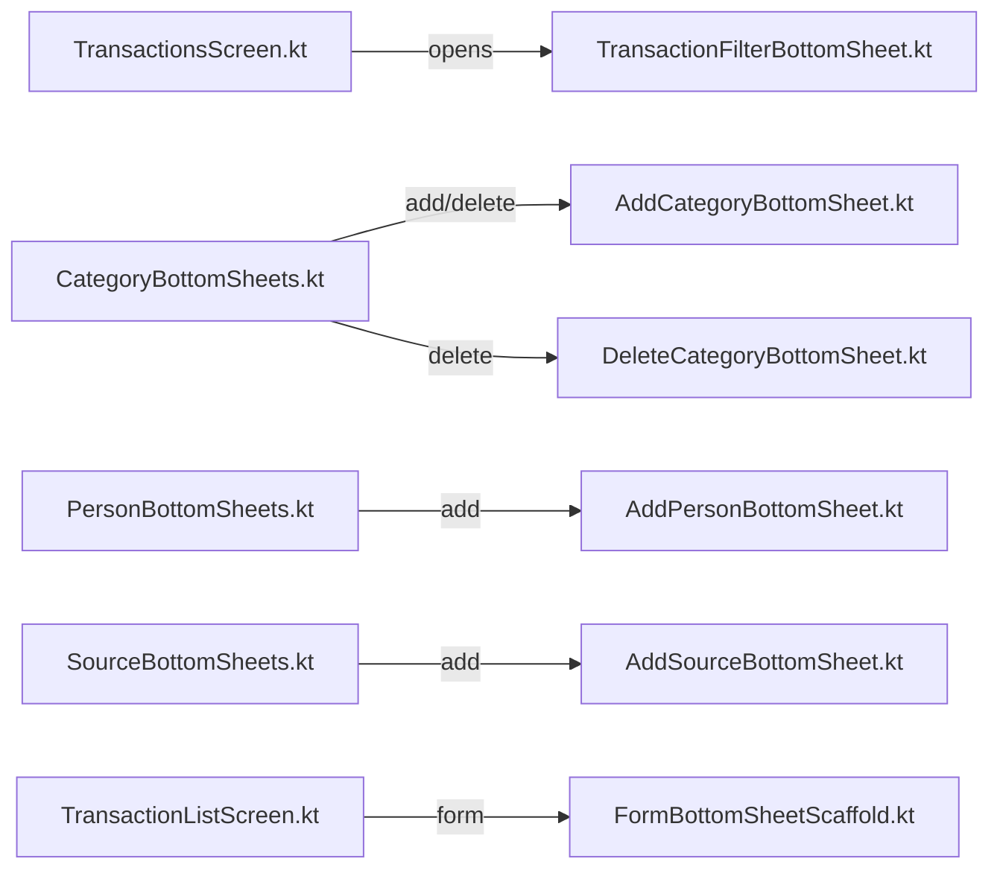
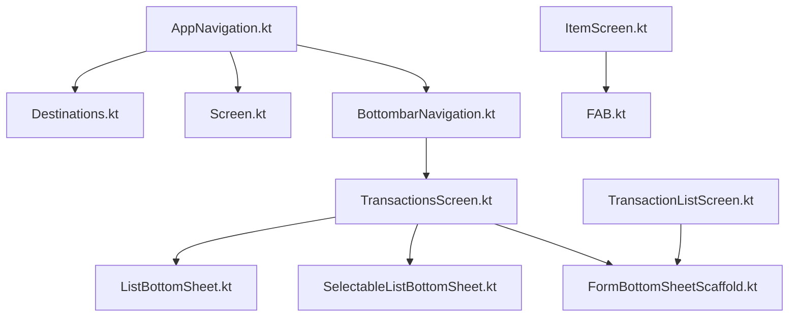

# Navigation and Layout Components

<cite>
**Referenced Files in This Document**
- [ListBottomSheet.kt](file://core/designsystem/src/commonMain/kotlin/com/kazemieh/designsystem/component/bottomsheet/ListBottomSheet.kt)
- [SelectableListBottomSheet.kt](file://core/designsystem/src/commonMain/kotlin/com/kazemieh/designsystem/component/bottomsheet/SelectableListBottomSheet.kt)
- [FormBottomSheetScaffold.kt](file://core/designsystem/src/commonMain/kotlin/com/kazemieh/designsystem/component/bottomsheet/FormBottomSheetScaffold.kt)
- [ItemScreen.kt](file://core/designsystem/src/commonMain/kotlin/com/kazemieh/designsystem/component/ItemScreen.kt)
- [FAB.kt](file://core/designsystem/src/commonMain/kotlin/com/kazemieh/designsystem/component/FAB.kt)
- [AppNavigation.kt](file://composeApp/src/commonMain/kotlin/com/kazemieh/composeApp/navigation/AppNavigation.kt)
- [Destinations.kt](file://composeApp/src/commonMain/kotlin/com/kazemieh/composeApp/navigation/Destinations.kt)
- [Screen.kt](file://composeApp/src/commonMain/kotlin/com/kazemieh/composeApp/navigation/Screen.kt)
- [BottombarNavigation.kt](file://composeApp/src/commonMain/kotlin/com/kazemieh/composeApp/navigation/navigationBar/BottombarNavigation.kt)
- [FintrackNavigationBar.kt](file://composeApp/src/commonMain/kotlin/com/kazemieh/composeApp/navigation/navigationBar/FintrackNavigationBar.kt)
- [TransactionsScreen.kt](file://feature-container/transactions/src/commonMain/kotlin/com/kazemieh/transactions/TransactionsScreen.kt)
- [TransactionFilterBottomSheet.kt](file://feature-container/transactions/src/commonMain/kotlin/com/kazemieh/transactions/TransactionFilterBottomSheet.kt)
- [TransactionListScreen.kt](file://feature-share/transaction/src/commonMain/kotlin/com/kazemieh/transaction/ui/main/TransactionListScreen.kt)
- [CategoryBottomSheets.kt](file://feature-share/category/src/commonMain/kotlin/com/kazemieh/category/ui/list/CategoryBottomSheets.kt)
- [AddCategoryBottomSheet.kt](file://feature-share/category/src/commonMain/kotlin/com/kazemieh/category/ui/add/AddCategoryBottomSheet.kt)
- [DeleteCategoryBottomSheet.kt](file://feature-share/category/src/commonMain/kotlin/com/kazemieh/category/ui/delete/DeleteCategoryBottomSheet.kt)
- [AddPersonBottomSheet.kt](file://feature-share/person/src/commonMain/kotlin/com/kazemieh/person/ui/add/AddPersonBottomSheet.kt)
- [PersonBottomSheets.kt](file://feature-share/person/src/commonMain/kotlin/com/kazemieh/person/ui/list/PersonBottomSheets.kt)
- [AddSourceBottomSheet.kt](file://feature-share/source/src/commonMain/kotlin/com/kazemieh/financialsource/ui/add/AddSourceBottomSheet.kt)
- [SourceBottomSheets.kt](file://feature-share/source/src/commonMain/kotlin/com/kazemieh/financialsource/ui/list/SourceBottomSheets.kt)
- [AddTagBottomSheet.kt](file://feature-share/tags/src/commonMain/kotlin/com/kazemieh/tag/ui/add/AddTagBottomSheet.kt)
- [SearchScreen.kt](file://feature-share/search/src/commonMain/kotlin/com/kazemieh/search/ui/SearchScreen.kt)
- [ProfileEditScreen.kt](file://feature-container/profile/src/commonMain/kotlin/com/kazemieh/profile/ProfileEditScreen.kt)
- [ThemeAndCurrencyScreen.kt](file://feature-container/profile/src/commonMain/kotlin/com/kazemieh/profile/ThemeAndCurrencyScreen.kt)
- [DashboardScreen.kt](file://feature-container/dashboard/src/commonMain/kotlin/com/kazemieh/dashboard/DashboardScreen.kt)
- [ToolsScreen.kt](file://feature-container/tools/src/commonMain/kotlin/com/kazemieh/tools/ToolsScreen.kt)
</cite>

## Table of Contents
1. [Introduction](#introduction)
2. [Project Structure](#project-structure)
3. [Core Components](#core-components)
4. [Architecture Overview](#architecture-overview)
5. [Detailed Component Analysis](#detailed-component-analysis)
6. [Dependency Analysis](#dependency-analysis)
7. [Performance Considerations](#performance-considerations)
8. [Troubleshooting Guide](#troubleshooting-guide)
9. [Conclusion](#conclusion)

## Introduction
This document focuses on FinTrack’s navigation and layout components with emphasis on screen organization and user flow management. It covers reusable bottom sheet implementations, modal presentation patterns, and screen transitions. The primary components analyzed here are:
- ListBottomSheet and SelectableListBottomSheet for list-based selection modals
- FormBottomSheetScaffold for form-driven bottom sheets
- ItemScreen for item-centric screens
- FAB for floating actions integrated with navigation
- Navigation infrastructure including destinations, screens, and bottom bar integration

The goal is to explain how these components collaborate to deliver responsive, accessible, and performant user experiences across platforms.

## Project Structure
FinTrack organizes navigation and UI under a shared design system and feature modules:
- Navigation and screen definitions live in the compose application module
- Reusable UI components (including bottom sheets and screens) live in the design system
- Feature screens and specialized bottom sheets live in feature modules

**Diagram sources**
- [AppNavigation.kt](file://composeApp/src/commonMain/kotlin/com/kazemieh/composeApp/navigation/AppNavigation.kt)
- [Destinations.kt](file://composeApp/src/commonMain/kotlin/com/kazemieh/composeApp/navigation/Destinations.kt)
- [Screen.kt](file://composeApp/src/commonMain/kotlin/com/kazemieh/composeApp/navigation/Screen.kt)
- [BottombarNavigation.kt](file://composeApp/src/commonMain/kotlin/com/kazemieh/composeApp/navigation/navigationBar/BottombarNavigation.kt)
- [FintrackNavigationBar.kt](file://composeApp/src/commonMain/kotlin/com/kazemieh/composeApp/navigation/navigationBar/FintrackNavigationBar.kt)
- [ListBottomSheet.kt](file://core/designsystem/src/commonMain/kotlin/com/kazemieh/designsystem/component/bottomsheet/ListBottomSheet.kt)
- [SelectableListBottomSheet.kt](file://core/designsystem/src/commonMain/kotlin/com/kazemieh/designsystem/component/bottomsheet/SelectableListBottomSheet.kt)
- [FormBottomSheetScaffold.kt](file://core/designsystem/src/commonMain/kotlin/com/kazemieh/designsystem/component/bottomsheet/FormBottomSheetScaffold.kt)
- [ItemScreen.kt](file://core/designsystem/src/commonMain/kotlin/com/kazemieh/designsystem/component/ItemScreen.kt)
- [FAB.kt](file://core/designsystem/src/commonMain/kotlin/com/kazemieh/designsystem/component/FAB.kt)
- [TransactionsScreen.kt](file://feature-container/transactions/src/commonMain/kotlin/com/kazemieh/transactions/TransactionsScreen.kt)
- [TransactionFilterBottomSheet.kt](file://feature-container/transactions/src/commonMain/kotlin/com/kazemieh/transactions/TransactionFilterBottomSheet.kt)
- [TransactionListScreen.kt](file://feature-share/transaction/src/commonMain/kotlin/com/kazemieh/transaction/ui/main/TransactionListScreen.kt)
- [CategoryBottomSheets.kt](file://feature-share/category/src/commonMain/kotlin/com/kazemieh/category/ui/list/CategoryBottomSheets.kt)
- [AddCategoryBottomSheet.kt](file://feature-share/category/src/commonMain/kotlin/com/kazemieh/category/ui/add/AddCategoryBottomSheet.kt)
- [DeleteCategoryBottomSheet.kt](file://feature-share/category/src/commonMain/kotlin/com/kazemieh/category/ui/delete/DeleteCategoryBottomSheet.kt)
- [AddPersonBottomSheet.kt](file://feature-share/person/src/commonMain/kotlin/com/kazemieh/person/ui/add/AddPersonBottomSheet.kt)
- [PersonBottomSheets.kt](file://feature-share/person/src/commonMain/kotlin/com/kazemieh/person/ui/list/PersonBottomSheets.kt)
- [AddSourceBottomSheet.kt](file://feature-share/source/src/commonMain/kotlin/com/kazemieh/financialsource/ui/add/AddSourceBottomSheet.kt)
- [SourceBottomSheets.kt](file://feature-share/source/src/commonMain/kotlin/com/kazemieh/financialsource/ui/list/SourceBottomSheets.kt)
- [AddTagBottomSheet.kt](file://feature-share/tags/src/commonMain/kotlin/com/kazemieh/tag/ui/add/AddTagBottomSheet.kt)
- [SearchScreen.kt](file://feature-share/search/src/commonMain/kotlin/com/kazemieh/search/ui/SearchScreen.kt)
- [ProfileEditScreen.kt](file://feature-container/profile/src/commonMain/kotlin/com/kazemieh/profile/ProfileEditScreen.kt)
- [ThemeAndCurrencyScreen.kt](file://feature-container/profile/src/commonMain/kotlin/com/kazemieh/profile/ThemeAndCurrencyScreen.kt)
- [DashboardScreen.kt](file://feature-container/dashboard/src/commonMain/kotlin/com/kazemieh/dashboard/DashboardScreen.kt)
- [ToolsScreen.kt](file://feature-container/tools/src/commonMain/kotlin/com/kazemieh/tools/ToolsScreen.kt)

**Section sources**
- [AppNavigation.kt](file://composeApp/src/commonMain/kotlin/com/kazemieh/composeApp/navigation/AppNavigation.kt)
- [Destinations.kt](file://composeApp/src/commonMain/kotlin/com/kazemieh/composeApp/navigation/Destinations.kt)
- [Screen.kt](file://composeApp/src/commonMain/kotlin/com/kazemieh/composeApp/navigation/Screen.kt)
- [BottombarNavigation.kt](file://composeApp/src/commonMain/kotlin/com/kazemieh/composeApp/navigation/navigationBar/BottombarNavigation.kt)
- [FintrackNavigationBar.kt](file://composeApp/src/commonMain/kotlin/com/kazemieh/composeApp/navigation/navigationBar/FintrackNavigationBar.kt)

## Core Components
This section documents the core navigation and layout components and their roles in FinTrack.

- ListBottomSheet: A generic bottom sheet for presenting a scrollable list of items with optional actions and callbacks.
- SelectableListBottomSheet: A variant enabling single or multi-selection modes with confirm/cancel flows.
- FormBottomSheetScaffold: A scaffold tailored for forms inside bottom sheets, handling validation, submission, and cancellation.
- ItemScreen: A screen container optimized for item-centric views, integrating top bars, content areas, and actions.
- FAB: A floating action button designed to trigger navigation or actions aligned with current screen context.

These components are platform-agnostic and intended for reuse across screens and features.

**Section sources**
- [ListBottomSheet.kt](file://core/designsystem/src/commonMain/kotlin/com/kazemieh/designsystem/component/bottomsheet/ListBottomSheet.kt)
- [SelectableListBottomSheet.kt](file://core/designsystem/src/commonMain/kotlin/com/kazemieh/designsystem/component/bottomsheet/SelectableListBottomSheet.kt)
- [FormBottomSheetScaffold.kt](file://core/designsystem/src/commonMain/kotlin/com/kazemieh/designsystem/component/bottomsheet/FormBottomSheetScaffold.kt)
- [ItemScreen.kt](file://core/designsystem/src/commonMain/kotlin/com/kazemieh/designsystem/component/ItemScreen.kt)
- [FAB.kt](file://core/designsystem/src/commonMain/kotlin/com/kazemieh/designsystem/component/FAB.kt)

## Architecture Overview
FinTrack’s navigation architecture centers around a declarative navigation graph and a bottom bar for primary destinations. Screens are organized by feature modules, while reusable UI components reside in the design system. Bottom sheets are used for secondary actions, selections, and forms.

**Diagram sources**
- [AppNavigation.kt](file://composeApp/src/commonMain/kotlin/com/kazemieh/composeApp/navigation/AppNavigation.kt)
- [Destinations.kt](file://composeApp/src/commonMain/kotlin/com/kazemieh/composeApp/navigation/Destinations.kt)
- [Screen.kt](file://composeApp/src/commonMain/kotlin/com/kazemieh/composeApp/navigation/Screen.kt)
- [BottombarNavigation.kt](file://composeApp/src/commonMain/kotlin/com/kazemieh/composeApp/navigation/navigationBar/BottombarNavigation.kt)
- [FintrackNavigationBar.kt](file://composeApp/src/commonMain/kotlin/com/kazemieh/composeApp/navigation/navigationBar/FintrackNavigationBar.kt)
- [TransactionsScreen.kt](file://feature-container/transactions/src/commonMain/kotlin/com/kazemieh/transactions/TransactionsScreen.kt)
- [TransactionListScreen.kt](file://feature-share/transaction/src/commonMain/kotlin/com/kazemieh/transaction/ui/main/TransactionListScreen.kt)
- [SearchScreen.kt](file://feature-share/search/src/commonMain/kotlin/com/kazemieh/search/ui/SearchScreen.kt)
- [ProfileEditScreen.kt](file://feature-container/profile/src/commonMain/kotlin/com/kazemieh/profile/ProfileEditScreen.kt)
- [ThemeAndCurrencyScreen.kt](file://feature-container/profile/src/commonMain/kotlin/com/kazemieh/profile/ThemeAndCurrencyScreen.kt)
- [DashboardScreen.kt](file://feature-container/dashboard/src/commonMain/kotlin/com/kazemieh/dashboard/DashboardScreen.kt)
- [ToolsScreen.kt](file://feature-container/tools/src/commonMain/kotlin/com/kazemieh/tools/ToolsScreen.kt)
- [ListBottomSheet.kt](file://core/designsystem/src/commonMain/kotlin/com/kazemieh/designsystem/component/bottomsheet/ListBottomSheet.kt)
- [SelectableListBottomSheet.kt](file://core/designsystem/src/commonMain/kotlin/com/kazemieh/designsystem/component/bottomsheet/SelectableListBottomSheet.kt)
- [FormBottomSheetScaffold.kt](file://core/designsystem/src/commonMain/kotlin/com/kazemieh/designsystem/component/bottomsheet/FormBottomSheetScaffold.kt)
- [ItemScreen.kt](file://core/designsystem/src/commonMain/kotlin/com/kazemieh/designsystem/component/ItemScreen.kt)
- [FAB.kt](file://core/designsystem/src/commonMain/kotlin/com/kazemieh/designsystem/component/FAB.kt)

## Detailed Component Analysis

### ListBottomSheet
- Purpose: Presents a list of selectable or actionable items in a bottom sheet modal.
- Interaction model: Accepts item lists, optional header/title, and callbacks for item selection or actions.
- Layout behavior: Uses a scrollable area suitable for long lists; integrates with system insets and safe areas.
- Accessibility: Supports content descriptions and focus order for keyboard/screen reader navigation.
- Cross-platform: Implemented in common Kotlin; platform-specific rendering handled by Compose.

**Diagram sources**
- [ListBottomSheet.kt](file://core/designsystem/src/commonMain/kotlin/com/kazemieh/designsystem/component/bottomsheet/ListBottomSheet.kt)

**Section sources**
- [ListBottomSheet.kt](file://core/designsystem/src/commonMain/kotlin/com/kazemieh/designsystem/component/bottomsheet/ListBottomSheet.kt)

### SelectableListBottomSheet
- Purpose: Enables single or multi-select modes within a bottom sheet.
- Interaction model: Provides confirm and cancel actions; returns selected items upon confirmation.
- Layout behavior: Adapts to selection mode and handles dense lists efficiently.
- Accessibility: Announces selection state and supports keyboard navigation.

**Diagram sources**
- [SelectableListBottomSheet.kt](file://core/designsystem/src/commonMain/kotlin/com/kazemieh/designsystem/component/bottomsheet/SelectableListBottomSheet.kt)

**Section sources**
- [SelectableListBottomSheet.kt](file://core/designsystem/src/commonMain/kotlin/com/kazemieh/designsystem/component/bottomsheet/SelectableListBottomSheet.kt)

### FormBottomSheetScaffold
- Purpose: Hosts form content inside a bottom sheet with built-in submit/cancel controls.
- Interaction model: Validates inputs, submits on confirm, cancels and dismisses on cancel.
- Layout behavior: Adapts to keyboard visibility and content height; supports nested scrolling.
- Accessibility: Integrates with form semantics and input focus management.

**Diagram sources**
- [FormBottomSheetScaffold.kt](file://core/designsystem/src/commonMain/kotlin/com/kazemieh/designsystem/component/bottomsheet/FormBottomSheetScaffold.kt)

**Section sources**
- [FormBottomSheetScaffold.kt](file://core/designsystem/src/commonMain/kotlin/com/kazemieh/designsystem/component/bottomsheet/FormBottomSheetScaffold.kt)

### ItemScreen
- Purpose: Encapsulates item-centric UI with top bar, content area, and action region.
- Layout behavior: Responsive to orientation and window size; integrates with system bars.
- Accessibility: Provides semantic structure and navigation affordances.

**Diagram sources**
- [ItemScreen.kt](file://core/designsystem/src/commonMain/kotlin/com/kazemieh/designsystem/component/ItemScreen.kt)

**Section sources**
- [ItemScreen.kt](file://core/designsystem/src/commonMain/kotlin/com/kazemieh/designsystem/component/ItemScreen.kt)

### FAB
- Purpose: Floating action button to trigger primary actions or navigations.
- Interaction model: Responds to clicks and integrates with current screen context.
- Layout behavior: Anchors to content and respects system insets and other overlays.

**Diagram sources**
- [FAB.kt](file://core/designsystem/src/commonMain/kotlin/com/kazemieh/designsystem/component/FAB.kt)

**Section sources**
- [FAB.kt](file://core/designsystem/src/commonMain/kotlin/com/kazemieh/designsystem/component/FAB.kt)

### Navigation Composition and Transitions
- Destinations define named destinations for screens and bottom sheets.
- AppNavigation composes the navigation graph and manages transitions.
- Bottom bar routes to primary destinations; secondary actions open bottom sheets.

**Diagram sources**
- [AppNavigation.kt](file://composeApp/src/commonMain/kotlin/com/kazemieh/composeApp/navigation/AppNavigation.kt)
- [Destinations.kt](file://composeApp/src/commonMain/kotlin/com/kazemieh/composeApp/navigation/Destinations.kt)
- [Screen.kt](file://composeApp/src/commonMain/kotlin/com/kazemieh/composeApp/navigation/Screen.kt)
- [BottombarNavigation.kt](file://composeApp/src/commonMain/kotlin/com/kazemieh/composeApp/navigation/navigationBar/BottombarNavigation.kt)
- [FintrackNavigationBar.kt](file://composeApp/src/commonMain/kotlin/com/kazemieh/composeApp/navigation/navigationBar/FintrackNavigationBar.kt)

**Section sources**
- [AppNavigation.kt](file://composeApp/src/commonMain/kotlin/com/kazemieh/composeApp/navigation/AppNavigation.kt)
- [Destinations.kt](file://composeApp/src/commonMain/kotlin/com/kazemieh/composeApp/navigation/Destinations.kt)
- [Screen.kt](file://composeApp/src/commonMain/kotlin/com/kazemieh/composeApp/navigation/Screen.kt)
- [BottombarNavigation.kt](file://composeApp/src/commonMain/kotlin/com/kazemieh/composeApp/navigation/navigationBar/BottombarNavigation.kt)
- [FintrackNavigationBar.kt](file://composeApp/src/commonMain/kotlin/com/kazemieh/composeApp/navigation/navigationBar/FintrackNavigationBar.kt)

### Feature-Specific Bottom Sheets and Screens
- TransactionsScreen integrates filter and list screens with bottom sheets for filtering and actions.
- Category, Person, Source, and Tag features provide add/delete/list bottom sheets for CRUD operations.
- TransactionListScreen uses form scaffolds for editing and adding entries.

**Diagram sources**
- [TransactionsScreen.kt](file://feature-container/transactions/src/commonMain/kotlin/com/kazemieh/transactions/TransactionsScreen.kt)
- [TransactionFilterBottomSheet.kt](file://feature-container/transactions/src/commonMain/kotlin/com/kazemieh/transactions/TransactionFilterBottomSheet.kt)
- [CategoryBottomSheets.kt](file://feature-share/category/src/commonMain/kotlin/com/kazemieh/category/ui/list/CategoryBottomSheets.kt)
- [AddCategoryBottomSheet.kt](file://feature-share/category/src/commonMain/kotlin/com/kazemieh/category/ui/add/AddCategoryBottomSheet.kt)
- [DeleteCategoryBottomSheet.kt](file://feature-share/category/src/commonMain/kotlin/com/kazemieh/category/ui/delete/DeleteCategoryBottomSheet.kt)
- [PersonBottomSheets.kt](file://feature-share/person/src/commonMain/kotlin/com/kazemieh/person/ui/list/PersonBottomSheets.kt)
- [AddPersonBottomSheet.kt](file://feature-share/person/src/commonMain/kotlin/com/kazemieh/person/ui/add/AddPersonBottomSheet.kt)
- [SourceBottomSheets.kt](file://feature-share/source/src/commonMain/kotlin/com/kazemieh/financialsource/ui/list/SourceBottomSheets.kt)
- [AddSourceBottomSheet.kt](file://feature-share/source/src/commonMain/kotlin/com/kazemieh/financialsource/ui/add/AddSourceBottomSheet.kt)
- [TransactionListScreen.kt](file://feature-share/transaction/src/commonMain/kotlin/com/kazemieh/transaction/ui/main/TransactionListScreen.kt)
- [FormBottomSheetScaffold.kt](file://core/designsystem/src/commonMain/kotlin/com/kazemieh/designsystem/component/bottomsheet/FormBottomSheetScaffold.kt)

**Section sources**
- [TransactionsScreen.kt](file://feature-container/transactions/src/commonMain/kotlin/com/kazemieh/transactions/TransactionsScreen.kt)
- [TransactionFilterBottomSheet.kt](file://feature-container/transactions/src/commonMain/kotlin/com/kazemieh/transactions/TransactionFilterBottomSheet.kt)
- [CategoryBottomSheets.kt](file://feature-share/category/src/commonMain/kotlin/com/kazemieh/category/ui/list/CategoryBottomSheets.kt)
- [AddCategoryBottomSheet.kt](file://feature-share/category/src/commonMain/kotlin/com/kazemieh/category/ui/add/AddCategoryBottomSheet.kt)
- [DeleteCategoryBottomSheet.kt](file://feature-share/category/src/commonMain/kotlin/com/kazemieh/category/ui/delete/DeleteCategoryBottomSheet.kt)
- [PersonBottomSheets.kt](file://feature-share/person/src/commonMain/kotlin/com/kazemieh/person/ui/list/PersonBottomSheets.kt)
- [AddPersonBottomSheet.kt](file://feature-share/person/src/commonMain/kotlin/com/kazemieh/person/ui/add/AddPersonBottomSheet.kt)
- [SourceBottomSheets.kt](file://feature-share/source/src/commonMain/kotlin/com/kazemieh/financialsource/ui/list/SourceBottomSheets.kt)
- [AddSourceBottomSheet.kt](file://feature-share/source/src/commonMain/kotlin/com/kazemieh/financialsource/ui/add/AddSourceBottomSheet.kt)
- [TransactionListScreen.kt](file://feature-share/transaction/src/commonMain/kotlin/com/kazemieh/transaction/ui/main/TransactionListScreen.kt)
- [FormBottomSheetScaffold.kt](file://core/designsystem/src/commonMain/kotlin/com/kazemieh/designsystem/component/bottomsheet/FormBottomSheetScaffold.kt)

## Dependency Analysis
- Navigation depends on destinations and screens to resolve targets.
- Bottom sheets depend on reusable UI components for consistent behavior.
- Feature screens depend on bottom sheets for secondary actions and forms.
- Bottom bar routes to feature screens; screens may open bottom sheets.

**Diagram sources**
- [AppNavigation.kt](file://composeApp/src/commonMain/kotlin/com/kazemieh/composeApp/navigation/AppNavigation.kt)
- [Destinations.kt](file://composeApp/src/commonMain/kotlin/com/kazemieh/composeApp/navigation/Destinations.kt)
- [Screen.kt](file://composeApp/src/commonMain/kotlin/com/kazemieh/composeApp/navigation/Screen.kt)
- [BottombarNavigation.kt](file://composeApp/src/commonMain/kotlin/com/kazemieh/composeApp/navigation/navigationBar/BottombarNavigation.kt)
- [TransactionsScreen.kt](file://feature-container/transactions/src/commonMain/kotlin/com/kazemieh/transactions/TransactionsScreen.kt)
- [ListBottomSheet.kt](file://core/designsystem/src/commonMain/kotlin/com/kazemieh/designsystem/component/bottomsheet/ListBottomSheet.kt)
- [SelectableListBottomSheet.kt](file://core/designsystem/src/commonMain/kotlin/com/kazemieh/designsystem/component/bottomsheet/SelectableListBottomSheet.kt)
- [FormBottomSheetScaffold.kt](file://core/designsystem/src/commonMain/kotlin/com/kazemieh/designsystem/component/bottomsheet/FormBottomSheetScaffold.kt)
- [TransactionListScreen.kt](file://feature-share/transaction/src/commonMain/kotlin/com/kazemieh/transaction/ui/main/TransactionListScreen.kt)
- [ItemScreen.kt](file://core/designsystem/src/commonMain/kotlin/com/kazemieh/designsystem/component/ItemScreen.kt)
- [FAB.kt](file://core/designsystem/src/commonMain/kotlin/com/kazemieh/designsystem/component/FAB.kt)

**Section sources**
- [AppNavigation.kt](file://composeApp/src/commonMain/kotlin/com/kazemieh/composeApp/navigation/AppNavigation.kt)
- [Destinations.kt](file://composeApp/src/commonMain/kotlin/com/kazemieh/composeApp/navigation/Destinations.kt)
- [Screen.kt](file://composeApp/src/commonMain/kotlin/com/kazemieh/composeApp/navigation/Screen.kt)
- [BottombarNavigation.kt](file://composeApp/src/commonMain/kotlin/com/kazemieh/composeApp/navigation/navigationBar/BottombarNavigation.kt)
- [TransactionsScreen.kt](file://feature-container/transactions/src/commonMain/kotlin/com/kazemieh/transactions/TransactionsScreen.kt)
- [ListBottomSheet.kt](file://core/designsystem/src/commonMain/kotlin/com/kazemieh/designsystem/component/bottomsheet/ListBottomSheet.kt)
- [SelectableListBottomSheet.kt](file://core/designsystem/src/commonMain/kotlin/com/kazemieh/designsystem/component/bottomsheet/SelectableListBottomSheet.kt)
- [FormBottomSheetScaffold.kt](file://core/designsystem/src/commonMain/kotlin/com/kazemieh/designsystem/component/bottomsheet/FormBottomSheetScaffold.kt)
- [TransactionListScreen.kt](file://feature-share/transaction/src/commonMain/kotlin/com/kazemieh/transaction/ui/main/TransactionListScreen.kt)
- [ItemScreen.kt](file://core/designsystem/src/commonMain/kotlin/com/kazemieh/designsystem/component/ItemScreen.kt)
- [FAB.kt](file://core/designsystem/src/commonMain/kotlin/com/kazemieh/designsystem/component/FAB.kt)

## Performance Considerations
- Prefer lazy lists in bottom sheets to handle large datasets efficiently.
- Use recomposition boundaries to minimize unnecessary UI updates when opening/closing modals.
- Defer heavy computations until after bottom sheet opens to keep modal presentation smooth.
- Reuse common UI components to reduce duplication and improve maintainability.
- Optimize form validation to avoid blocking the UI thread; consider asynchronous checks where appropriate.
- Ensure bottom sheets dismiss promptly on confirm/cancel to prevent overlapping modals.

## Troubleshooting Guide
- Bottom sheet not dismissing: Verify confirm/cancel handlers are invoked and the modal state is updated accordingly.
- Keyboard overlaps content: Ensure the form scaffold accounts for keyboard visibility and adjusts layout dynamically.
- Navigation conflicts: Confirm destinations are unique and navigation graph resolves correctly without ambiguity.
- Accessibility issues: Validate content descriptions and focus order for bottom sheets and FABs.
- Cross-platform differences: Test bottom sheet behavior on different screen sizes and orientations; adjust padding and layout constraints as needed.

## Conclusion
FinTrack’s navigation and layout components provide a cohesive foundation for screen organization and user flow management. By leveraging reusable bottom sheets, form scaffolds, and a structured navigation graph, the app achieves consistent, accessible, and performant interactions across platforms. The documented components and patterns enable scalable development and maintainable UI architectures.