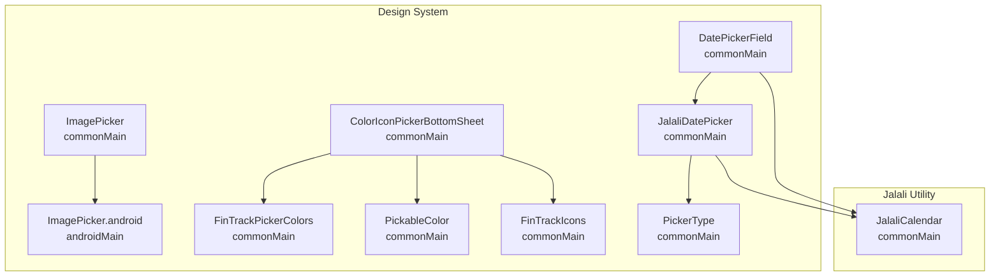
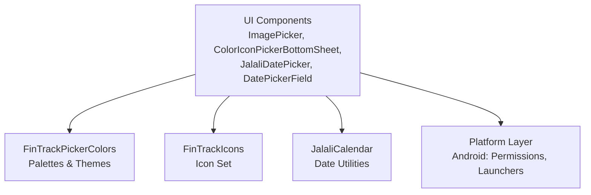
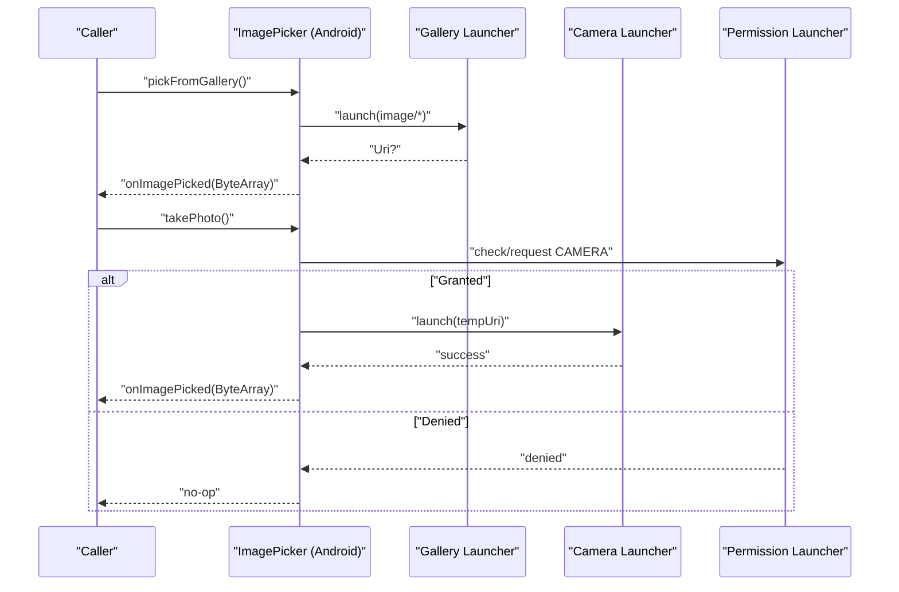
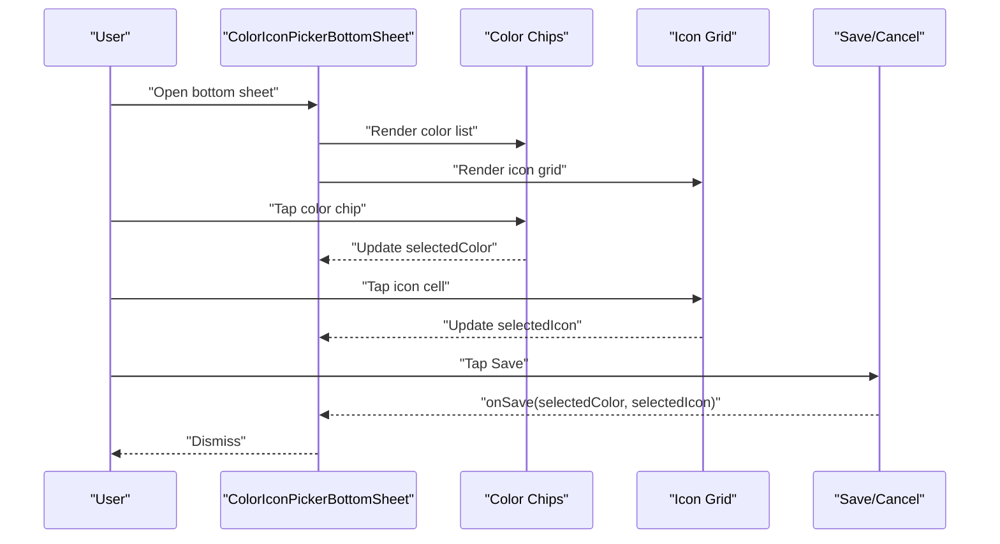
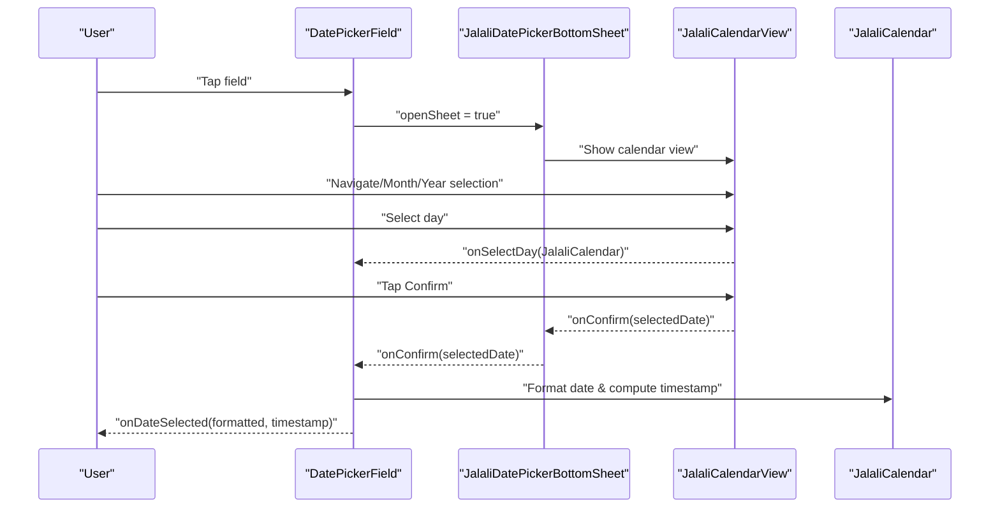
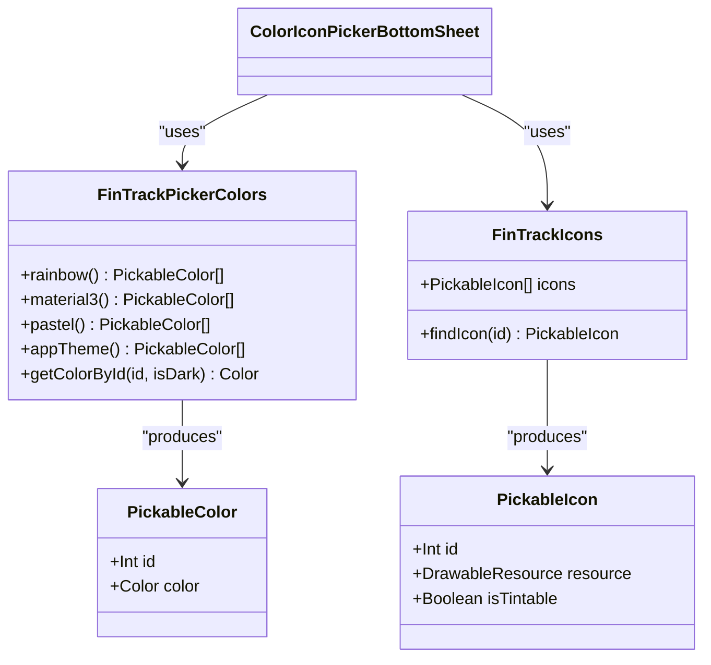
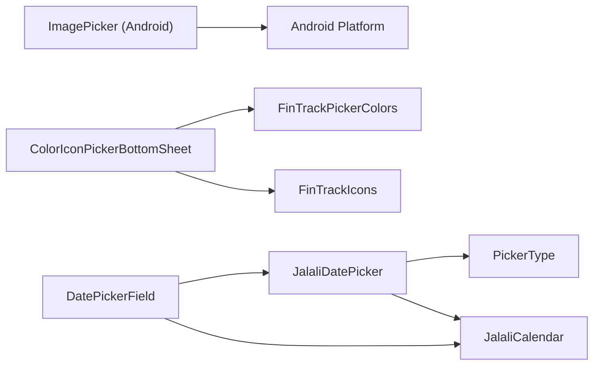

# Picker and Selection Components

<cite>
**Referenced Files in This Document**
- [ImagePicker.kt](file://core/designsystem/src/commonMain/kotlin/com/kazemieh/designsystem/component/Picker/ImagePicker.kt)
- [ImagePicker.android.kt](file://core/designsystem/src/androidMain/kotlin/com/kazemieh/designsystem/component/Picker/ImagePicker.android.kt)
- [ColorIconPickerBottomSheet.kt](file://core/designsystem/src/commonMain/kotlin/com/kazemieh/designsystem/picker/ColorIconPickerBottomSheet.kt)
- [FinTrackPickerColors.kt](file://core/designsystem/src/commonMain/kotlin/com/kazemieh/designsystem/picker/FinTrackPickerColors.kt)
- [PickableColor.kt](file://core/designsystem/src/commonMain/kotlin/com/kazemieh/designsystem/picker/PickableColor.kt)
- [FinTrackIcons.kt](file://core/designsystem/src/commonMain/kotlin/com/kazemieh/designsystem/picker/FinTrackIcons.kt)
- [JalaliDatePicker.kt](file://core/designsystem/src/commonMain/kotlin/com/kazemieh/designsystem/component/jalali/JalaliDatePicker.kt)
- [DatePickerField.kt](file://core/designsystem/src/commonMain/kotlin/com/kazemieh/designsystem/component/jalali/DatePickerField.kt)
- [PickerType.kt](file://core/designsystem/src/commonMain/kotlin/com/kazemieh/designsystem/component/jalali/PickerType.kt)
- [JalaliCalendar.kt](file://core/jalali/src/commonMain/kotlin/com/kazemieh/jalali/JalaliCalendar.kt)
</cite>

## Table of Contents
1. [Introduction](#introduction)
2. [Project Structure](#project-structure)
3. [Core Components](#core-components)
4. [Architecture Overview](#architecture-overview)
5. [Detailed Component Analysis](#detailed-component-analysis)
6. [Dependency Analysis](#dependency-analysis)
7. [Performance Considerations](#performance-considerations)
8. [Accessibility and Touch Interactions](#accessibility-and-touch-interactions)
9. [Troubleshooting Guide](#troubleshooting-guide)
10. [Conclusion](#conclusion)
11. [Appendices](#appendices)

## Introduction
This document explains FinTrack’s picker and selection components for images, colors, icons, and dates. It covers:
- ImagePicker and its platform-specific implementation
- ColorIconPickerBottomSheet for selecting a color and icon pair
- JalaliDatePicker and DatePickerField for Persian calendar date selection
- Selection behaviors, validation, user feedback, and integration with the Persian calendar
- Examples of composition, selection patterns, and building custom pickers
- Accessibility, touch interactions, and performance considerations

## Project Structure
The picker components live under the design system module, organized by feature and platform:
- ImagePicker is declared in common and implemented on Android
- ColorIconPickerBottomSheet and supporting models live under the picker package
- Jalali date pickers live under the jalali component package
- The JalaliCalendar utility supports date computations and conversions

**Diagram sources**
- [ImagePicker.kt:1-12](file://core/designsystem/src/commonMain/kotlin/com/kazemieh/designsystem/component/Picker/ImagePicker.kt#L1-L12)
- [ImagePicker.android.kt:1-71](file://core/designsystem/src/androidMain/kotlin/com/kazemieh/designsystem/component/Picker/ImagePicker.android.kt#L1-L71)
- [ColorIconPickerBottomSheet.kt:1-293](file://core/designsystem/src/commonMain/kotlin/com/kazemieh/designsystem/picker/ColorIconPickerBottomSheet.kt#L1-L293)
- [FinTrackPickerColors.kt:1-154](file://core/designsystem/src/commonMain/kotlin/com/kazemieh/designsystem/picker/FinTrackPickerColors.kt#L1-L154)
- [PickableColor.kt:1-22](file://core/designsystem/src/commonMain/kotlin/com/kazemieh/designsystem/picker/PickableColor.kt#L1-L22)
- [FinTrackIcons.kt:1-245](file://core/designsystem/src/commonMain/kotlin/com/kazemieh/designsystem/picker/FinTrackIcons.kt#L1-L245)
- [JalaliDatePicker.kt:1-496](file://core/designsystem/src/commonMain/kotlin/com/kazemieh/designsystem/component/jalali/JalaliDatePicker.kt#L1-L496)
- [DatePickerField.kt:1-174](file://core/designsystem/src/commonMain/kotlin/com/kazemieh/designsystem/component/jalali/DatePickerField.kt#L1-L174)
- [PickerType.kt:1-7](file://core/designsystem/src/commonMain/kotlin/com/kazemieh/designsystem/component/jalali/PickerType.kt#L1-L7)
- [JalaliCalendar.kt:1-121](file://core/jalali/src/commonMain/kotlin/com/kazemieh/jalali/JalaliCalendar.kt#L1-L121)

**Section sources**
- [ImagePicker.kt:1-12](file://core/designsystem/src/commonMain/kotlin/com/kazemieh/designsystem/component/Picker/ImagePicker.kt#L1-L12)
- [ImagePicker.android.kt:1-71](file://core/designsystem/src/androidMain/kotlin/com/kazemieh/designsystem/component/Picker/ImagePicker.android.kt#L1-L71)
- [ColorIconPickerBottomSheet.kt:1-293](file://core/designsystem/src/commonMain/kotlin/com/kazemieh/designsystem/picker/ColorIconPickerBottomSheet.kt#L1-L293)
- [FinTrackPickerColors.kt:1-154](file://core/designsystem/src/commonMain/kotlin/com/kazemieh/designsystem/picker/FinTrackPickerColors.kt#L1-L154)
- [PickableColor.kt:1-22](file://core/designsystem/src/commonMain/kotlin/com/kazemieh/designsystem/picker/PickableColor.kt#L1-L22)
- [FinTrackIcons.kt:1-245](file://core/designsystem/src/commonMain/kotlin/com/kazemieh/designsystem/picker/FinTrackIcons.kt#L1-L245)
- [JalaliDatePicker.kt:1-496](file://core/designsystem/src/commonMain/kotlin/com/kazemieh/designsystem/component/jalali/JalaliDatePicker.kt#L1-L496)
- [DatePickerField.kt:1-174](file://core/designsystem/src/commonMain/kotlin/com/kazemieh/designsystem/component/jalali/DatePickerField.kt#L1-L174)
- [PickerType.kt:1-7](file://core/designsystem/src/commonMain/kotlin/com/kazemieh/designsystem/component/jalali/PickerType.kt#L1-L7)
- [JalaliCalendar.kt:1-121](file://core/jalali/src/commonMain/kotlin/com/kazemieh/jalali/JalaliCalendar.kt#L1-L121)

## Core Components
- ImagePicker: A cross-platform interface to pick images from gallery or capture via camera. Implemented on Android using activity result launchers and permissions.
- ColorIconPickerBottomSheet: A bottom sheet allowing users to select a color and an icon; integrates with a palette provider and icon set.
- JalaliDatePicker and DatePickerField: A Persian calendar date picker with bottom sheet and dialog variants, plus a field wrapper for form-like usage.
- Supporting models: PickableColor, PickableIcon, FinTrackPickerColors, FinTrackIcons, and PickerType.

Selection behaviors:
- ImagePicker returns a ByteArray via a callback after successful selection.
- ColorIconPickerBottomSheet maintains separate selected color and icon state and emits a combined result on save.
- JalaliDatePicker manages internal temporary selection until confirmed; validates against optional before/after constraints.

Validation and feedback:
- Disabled states for navigation and confirm actions when outside allowed ranges.
- Visual indicators for today, selected date, and disabled dates.
- Resource-backed labels for Persian weekdays and month names.

**Section sources**
- [ImagePicker.kt:1-12](file://core/designsystem/src/commonMain/kotlin/com/kazemieh/designsystem/component/Picker/ImagePicker.kt#L1-L12)
- [ImagePicker.android.kt:1-71](file://core/designsystem/src/androidMain/kotlin/com/kazemieh/designsystem/component/Picker/ImagePicker.android.kt#L1-L71)
- [ColorIconPickerBottomSheet.kt:1-293](file://core/designsystem/src/commonMain/kotlin/com/kazemieh/designsystem/picker/ColorIconPickerBottomSheet.kt#L1-L293)
- [FinTrackPickerColors.kt:1-154](file://core/designsystem/src/commonMain/kotlin/com/kazemieh/designsystem/picker/FinTrackPickerColors.kt#L1-L154)
- [PickableColor.kt:1-22](file://core/designsystem/src/commonMain/kotlin/com/kazemieh/designsystem/picker/PickableColor.kt#L1-L22)
- [FinTrackIcons.kt:1-245](file://core/designsystem/src/commonMain/kotlin/com/kazemieh/designsystem/picker/FinTrackIcons.kt#L1-L245)
- [JalaliDatePicker.kt:1-496](file://core/designsystem/src/commonMain/kotlin/com/kazemieh/designsystem/component/jalali/JalaliDatePicker.kt#L1-L496)
- [DatePickerField.kt:1-174](file://core/designsystem/src/commonMain/kotlin/com/kazemieh/designsystem/component/jalali/DatePickerField.kt#L1-L174)
- [PickerType.kt:1-7](file://core/designsystem/src/commonMain/kotlin/com/kazemieh/designsystem/component/jalali/PickerType.kt#L1-L7)

## Architecture Overview
The picker components follow a layered pattern:
- Common UI components define APIs and shared logic
- Platform-specific implementations handle platform concerns (permissions, intents)
- Utility modules provide calendar conversion and validation

**Diagram sources**
- [ColorIconPickerBottomSheet.kt:1-293](file://core/designsystem/src/commonMain/kotlin/com/kazemieh/designsystem/picker/ColorIconPickerBottomSheet.kt#L1-L293)
- [FinTrackPickerColors.kt:1-154](file://core/designsystem/src/commonMain/kotlin/com/kazemieh/designsystem/picker/FinTrackPickerColors.kt#L1-L154)
- [FinTrackIcons.kt:1-245](file://core/designsystem/src/commonMain/kotlin/com/kazemieh/designsystem/picker/FinTrackIcons.kt#L1-L245)
- [JalaliDatePicker.kt:1-496](file://core/designsystem/src/commonMain/kotlin/com/kazemieh/designsystem/component/jalali/JalaliDatePicker.kt#L1-L496)
- [DatePickerField.kt:1-174](file://core/designsystem/src/commonMain/kotlin/com/kazemieh/designsystem/component/jalali/DatePickerField.kt#L1-L174)
- [JalaliCalendar.kt:1-121](file://core/jalali/src/commonMain/kotlin/com/kazemieh/jalali/JalaliCalendar.kt#L1-L121)
- [ImagePicker.kt:1-12](file://core/designsystem/src/commonMain/kotlin/com/kazemieh/designsystem/component/Picker/ImagePicker.kt#L1-L12)
- [ImagePicker.android.kt:1-71](file://core/designsystem/src/androidMain/kotlin/com/kazemieh/designsystem/component/Picker/ImagePicker.android.kt#L1-L71)

## Detailed Component Analysis

### ImagePicker
- Purpose: Provide a unified API to pick images from gallery or capture via camera.
- Implementation highlights:
  - Common expect declaration defines the API surface.
  - Android actual uses activity result contracts for gallery and camera, with runtime permission handling for camera.
  - Temporary file and FileProvider are used for camera output.
  - Emits a ByteArray to the caller upon success.

**Diagram sources**
- [ImagePicker.kt:1-12](file://core/designsystem/src/commonMain/kotlin/com/kazemieh/designsystem/component/Picker/ImagePicker.kt#L1-L12)
- [ImagePicker.android.kt:1-71](file://core/designsystem/src/androidMain/kotlin/com/kazemieh/designsystem/component/Picker/ImagePicker.android.kt#L1-L71)

**Section sources**
- [ImagePicker.kt:1-12](file://core/designsystem/src/commonMain/kotlin/com/kazemieh/designsystem/component/Picker/ImagePicker.kt#L1-L12)
- [ImagePicker.android.kt:1-71](file://core/designsystem/src/androidMain/kotlin/com/kazemieh/designsystem/component/Picker/ImagePicker.android.kt#L1-L71)

### ColorIconPickerBottomSheet
- Purpose: Allow users to choose a color and an icon pair in a bottom sheet.
- Key behaviors:
  - Preselects initial color/icon if provided; otherwise defaults to first entries.
  - Uses lazy lists/grids to render color chips and icon cells.
  - Emits combined result on Save and dismisses on Cancel.
  - Automatically scrolls to initial selections with a small delay to stabilize layout.

**Diagram sources**
- [ColorIconPickerBottomSheet.kt:1-293](file://core/designsystem/src/commonMain/kotlin/com/kazemieh/designsystem/picker/ColorIconPickerBottomSheet.kt#L1-L293)
- [FinTrackPickerColors.kt:1-154](file://core/designsystem/src/commonMain/kotlin/com/kazemieh/designsystem/picker/FinTrackPickerColors.kt#L1-L154)
- [PickableColor.kt:1-22](file://core/designsystem/src/commonMain/kotlin/com/kazemieh/designsystem/picker/PickableColor.kt#L1-L22)
- [FinTrackIcons.kt:1-245](file://core/designsystem/src/commonMain/kotlin/com/kazemieh/designsystem/picker/FinTrackIcons.kt#L1-L245)

**Section sources**
- [ColorIconPickerBottomSheet.kt:1-293](file://core/designsystem/src/commonMain/kotlin/com/kazemieh/designsystem/picker/ColorIconPickerBottomSheet.kt#L1-L293)
- [FinTrackPickerColors.kt:1-154](file://core/designsystem/src/commonMain/kotlin/com/kazemieh/designsystem/picker/FinTrackPickerColors.kt#L1-L154)
- [PickableColor.kt:1-22](file://core/designsystem/src/commonMain/kotlin/com/kazemieh/designsystem/picker/PickableColor.kt#L1-L22)
- [FinTrackIcons.kt:1-245](file://core/designsystem/src/commonMain/kotlin/com/kazemieh/designsystem/picker/FinTrackIcons.kt#L1-L245)

### JalaliDatePicker and DatePickerField
- Purpose: Provide a Persian calendar date selection experience with a bottom sheet and a convenience field component.
- Key behaviors:
  - Supports three picker modes: Year, Month, Day, controlled by PickerType.
  - Navigation controls adjust the visible month/year; confirm action finalizes selection.
  - Validates against disableBeforeDate and disableAfterDate constraints.
  - DatePickerField wraps the picker in a text field for form-like usage and returns formatted date string and timestamp.

**Diagram sources**
- [DatePickerField.kt:1-174](file://core/designsystem/src/commonMain/kotlin/com/kazemieh/designsystem/component/jalali/DatePickerField.kt#L1-L174)
- [JalaliDatePicker.kt:1-496](file://core/designsystem/src/commonMain/kotlin/com/kazemieh/designsystem/component/jalali/JalaliDatePicker.kt#L1-L496)
- [PickerType.kt:1-7](file://core/designsystem/src/commonMain/kotlin/com/kazemieh/designsystem/component/jalali/PickerType.kt#L1-L7)
- [JalaliCalendar.kt:1-121](file://core/jalali/src/commonMain/kotlin/com/kazemieh/jalali/JalaliCalendar.kt#L1-L121)

**Section sources**
- [DatePickerField.kt:1-174](file://core/designsystem/src/commonMain/kotlin/com/kazemieh/designsystem/component/jalali/DatePickerField.kt#L1-L174)
- [JalaliDatePicker.kt:1-496](file://core/designsystem/src/commonMain/kotlin/com/kazemieh/designsystem/component/jalali/JalaliDatePicker.kt#L1-L496)
- [PickerType.kt:1-7](file://core/designsystem/src/commonMain/kotlin/com/kazemieh/designsystem/component/jalali/PickerType.kt#L1-L7)
- [JalaliCalendar.kt:1-121](file://core/jalali/src/commonMain/kotlin/com/kazemieh/jalali/JalaliCalendar.kt#L1-L121)

### Data Models and Palettes
- PickableColor and PickableIcon represent selectable items with identifiers and rendering info.
- FinTrackPickerColors provides multiple palettes (rainbow, material3, pastel, appTheme) and theme-aware getters.
- FinTrackIcons provides a large icon set with resource-backed entries.

**Diagram sources**
- [PickableColor.kt:1-22](file://core/designsystem/src/commonMain/kotlin/com/kazemieh/designsystem/picker/PickableColor.kt#L1-L22)
- [FinTrackPickerColors.kt:1-154](file://core/designsystem/src/commonMain/kotlin/com/kazemieh/designsystem/picker/FinTrackPickerColors.kt#L1-L154)
- [FinTrackIcons.kt:1-245](file://core/designsystem/src/commonMain/kotlin/com/kazemieh/designsystem/picker/FinTrackIcons.kt#L1-L245)
- [ColorIconPickerBottomSheet.kt:1-293](file://core/designsystem/src/commonMain/kotlin/com/kazemieh/designsystem/picker/ColorIconPickerBottomSheet.kt#L1-L293)

**Section sources**
- [PickableColor.kt:1-22](file://core/designsystem/src/commonMain/kotlin/com/kazemieh/designsystem/picker/PickableColor.kt#L1-L22)
- [FinTrackPickerColors.kt:1-154](file://core/designsystem/src/commonMain/kotlin/com/kazemieh/designsystem/picker/FinTrackPickerColors.kt#L1-L154)
- [FinTrackIcons.kt:1-245](file://core/designsystem/src/commonMain/kotlin/com/kazemieh/designsystem/picker/FinTrackIcons.kt#L1-L245)
- [ColorIconPickerBottomSheet.kt:1-293](file://core/designsystem/src/commonMain/kotlin/com/kazemieh/designsystem/picker/ColorIconPickerBottomSheet.kt#L1-L293)

## Dependency Analysis
- ImagePicker depends on Android platform APIs for permissions and activity results.
- ColorIconPickerBottomSheet depends on FinTrackPickerColors and FinTrackIcons for rendering and selection.
- JalaliDatePicker and DatePickerField depend on JalaliCalendar for date computation and conversion.
- PickerType is a sealed class used by the calendar view to switch between views.

**Diagram sources**
- [ImagePicker.android.kt:1-71](file://core/designsystem/src/androidMain/kotlin/com/kazemieh/designsystem/component/Picker/ImagePicker.android.kt#L1-L71)
- [ColorIconPickerBottomSheet.kt:1-293](file://core/designsystem/src/commonMain/kotlin/com/kazemieh/designsystem/picker/ColorIconPickerBottomSheet.kt#L1-L293)
- [FinTrackPickerColors.kt:1-154](file://core/designsystem/src/commonMain/kotlin/com/kazemieh/designsystem/picker/FinTrackPickerColors.kt#L1-L154)
- [FinTrackIcons.kt:1-245](file://core/designsystem/src/commonMain/kotlin/com/kazemieh/designsystem/picker/FinTrackIcons.kt#L1-L245)
- [JalaliDatePicker.kt:1-496](file://core/designsystem/src/commonMain/kotlin/com/kazemieh/designsystem/component/jalali/JalaliDatePicker.kt#L1-L496)
- [DatePickerField.kt:1-174](file://core/designsystem/src/commonMain/kotlin/com/kazemieh/designsystem/component/jalali/DatePickerField.kt#L1-L174)
- [PickerType.kt:1-7](file://core/designsystem/src/commonMain/kotlin/com/kazemieh/designsystem/component/jalali/PickerType.kt#L1-L7)
- [JalaliCalendar.kt:1-121](file://core/jalali/src/commonMain/kotlin/com/kazemieh/jalali/JalaliCalendar.kt#L1-L121)

**Section sources**
- [ImagePicker.android.kt:1-71](file://core/designsystem/src/androidMain/kotlin/com/kazemieh/designsystem/component/Picker/ImagePicker.android.kt#L1-L71)
- [ColorIconPickerBottomSheet.kt:1-293](file://core/designsystem/src/commonMain/kotlin/com/kazemieh/designsystem/picker/ColorIconPickerBottomSheet.kt#L1-L293)
- [FinTrackPickerColors.kt:1-154](file://core/designsystem/src/commonMain/kotlin/com/kazemieh/designsystem/picker/FinTrackPickerColors.kt#L1-L154)
- [FinTrackIcons.kt:1-245](file://core/designsystem/src/commonMain/kotlin/com/kazemieh/designsystem/picker/FinTrackIcons.kt#L1-L245)
- [JalaliDatePicker.kt:1-496](file://core/designsystem/src/commonMain/kotlin/com/kazemieh/designsystem/component/jalali/JalaliDatePicker.kt#L1-L496)
- [DatePickerField.kt:1-174](file://core/designsystem/src/commonMain/kotlin/com/kazemieh/designsystem/component/jalali/DatePickerField.kt#L1-L174)
- [PickerType.kt:1-7](file://core/designsystem/src/commonMain/kotlin/com/kazemieh/designsystem/component/jalali/PickerType.kt#L1-L7)
- [JalaliCalendar.kt:1-121](file://core/jalali/src/commonMain/kotlin/com/kazemieh/jalali/JalaliCalendar.kt#L1-L121)

## Performance Considerations
- ImagePicker
  - Reading large images into memory as ByteArray can be expensive. Consider resizing or compressing before emitting to reduce memory pressure.
  - Reuse temporary file and URI to avoid repeated allocations.
- ColorIconPickerBottomSheet
  - Lazy lists and grids are efficient; ensure item keys are stable to minimize recompositions.
  - Avoid heavy work in the save callback; offload to background if needed.
- JalaliDatePicker
  - Year scrolling uses a LazyColumn; keep item count reasonable to prevent long scroll lists.
  - Prefer passing JalaliCalendar instances instead of timestamps for comparisons to avoid timezone conversions overhead.
  - Disable buttons and highlight only necessary states to reduce drawing overhead.

[No sources needed since this section provides general guidance]

## Accessibility and Touch Interactions
- ImagePicker
  - No explicit content descriptions are provided in the picker itself; callers should supply meaningful descriptions for screen readers.
- ColorIconPickerBottomSheet
  - Buttons and interactive items are clickable; ensure sufficient touch targets and contrast for selected states.
  - Consider adding content descriptions for icons and color chips if used outside the bottom sheet context.
- JalaliDatePicker
  - Text buttons and filled icon buttons are used; ensure focus order and keyboard navigation support if integrated into forms.
  - Today button visibility and disabled states improve usability; maintain clear visual states for disabled actions.

[No sources needed since this section provides general guidance]

## Troubleshooting Guide
- ImagePicker
  - Camera permission denied: The launcher requests permission; if denied, no photo is captured. Ensure app requests permission before launching camera.
  - Gallery selection returns null: Guard against null URIs and handle gracefully.
- ColorIconPickerBottomSheet
  - Initial selection not scrolled into view: A small delay animates to the initial index; ensure initial indices are valid.
  - Tinting mismatch: Only tint icons marked as tintable; verify isTintable flag.
- JalaliDatePicker
  - Disabled navigation: If disableBeforeDate/disableAfterDate restricts navigation, confirm constraints align with intended UX.
  - Confirm button disabled: The confirm button is enabled only when a date is selected; ensure onSelectDay updates selection state.

**Section sources**
- [ImagePicker.android.kt:1-71](file://core/designsystem/src/androidMain/kotlin/com/kazemieh/designsystem/component/Picker/ImagePicker.android.kt#L1-L71)
- [ColorIconPickerBottomSheet.kt:1-293](file://core/designsystem/src/commonMain/kotlin/com/kazemieh/designsystem/picker/ColorIconPickerBottomSheet.kt#L1-L293)
- [JalaliDatePicker.kt:1-496](file://core/designsystem/src/commonMain/kotlin/com/kazemieh/designsystem/component/jalali/JalaliDatePicker.kt#L1-L496)
- [DatePickerField.kt:1-174](file://core/designsystem/src/commonMain/kotlin/com/kazemieh/designsystem/component/jalali/DatePickerField.kt#L1-L174)

## Conclusion
FinTrack’s picker components provide a cohesive, theme-aware, and culturally appropriate selection experience:
- ImagePicker offers a clean abstraction over platform-specific image capture and selection.
- ColorIconPickerBottomSheet delivers a flexible palette and icon selection with immediate visual feedback.
- JalaliDatePicker integrates seamlessly with the Persian calendar, offering robust validation and user-friendly navigation.

These components are designed for composability, performance, and accessibility, enabling consistent user experiences across FinTrack screens.

[No sources needed since this section summarizes without analyzing specific files]

## Appendices

### Picker Composition Examples
- Image selection in a form:
  - Obtain an ImagePicker via the rememberImagePicker factory.
  - Call pickFromGallery or takePhoto based on user choice.
  - Receive ByteArray and process it (e.g., resize, upload).
- Color and icon selection:
  - Present ColorIconPickerBottomSheet with initial color/icon ids.
  - On save, receive the chosen color and icon and persist them.
- Date selection:
  - Use DatePickerField for a text-input-like experience; it opens the bottom sheet internally.
  - Alternatively, embed JalaliDatePickerBottomSheet directly and manage open state externally.

**Section sources**
- [ImagePicker.kt:1-12](file://core/designsystem/src/commonMain/kotlin/com/kazemieh/designsystem/component/Picker/ImagePicker.kt#L1-L12)
- [ImagePicker.android.kt:1-71](file://core/designsystem/src/androidMain/kotlin/com/kazemieh/designsystem/component/Picker/ImagePicker.android.kt#L1-L71)
- [ColorIconPickerBottomSheet.kt:1-293](file://core/designsystem/src/commonMain/kotlin/com/kazemieh/designsystem/picker/ColorIconPickerBottomSheet.kt#L1-L293)
- [DatePickerField.kt:1-174](file://core/designsystem/src/commonMain/kotlin/com/kazemieh/designsystem/component/jalali/DatePickerField.kt#L1-L174)
- [JalaliDatePicker.kt:1-496](file://core/designsystem/src/commonMain/kotlin/com/kazemieh/designsystem/component/jalali/JalaliDatePicker.kt#L1-L496)

### Custom Picker Creation Patterns
- Define a sealed PickerType similar to the existing one to control view modes.
- Use lazy layouts for large sets (colors/icons) to optimize rendering.
- Encapsulate validation logic for min/max ranges and apply disabled states consistently.
- Provide theme-aware color palettes and ensure luminance-based contrast for selected indicators.

**Section sources**
- [PickerType.kt:1-7](file://core/designsystem/src/commonMain/kotlin/com/kazemieh/designsystem/component/jalali/PickerType.kt#L1-L7)
- [FinTrackPickerColors.kt:1-154](file://core/designsystem/src/commonMain/kotlin/com/kazemieh/designsystem/picker/FinTrackPickerColors.kt#L1-L154)
- [FinTrackIcons.kt:1-245](file://core/designsystem/src/commonMain/kotlin/com/kazemieh/designsystem/picker/FinTrackIcons.kt#L1-L245)