# UI Components and Design System

<cite>
**Referenced Files in This Document**
- [AppTheme.kt](file://core/designsystem/src/commonMain/kotlin/com/kazemieh/designsystem/AppTheme.kt)
- [Color.kt](file://core/designsystem/src/commonMain/kotlin/com/kazemieh/designsystem/Color.kt)
- [Dimensions.kt](file://core/designsystem/src/commonMain/kotlin/com/kazemieh/designsystem/Dimensions.kt)
- [FintrackShapes.kt](file://core/designsystem/src/commonMain/kotlin/com/kazemieh/designsystem/FintrackShapes.kt)
- [FintrackTypography.kt](file://core/designsystem/src/commonMain/kotlin/com/kazemieh/designsystem/FintrackTypography.kt)
- [GlassColors.kt](file://core/designsystem/src/commonMain/kotlin/com/kazemieh/designsystem/GlassColors.kt)
- [Theme.kt](file://core/designsystem/src/commonMain/kotlin/com/kazemieh/designsystem/Theme.kt)
- [BottombarNavigation.kt](file://composeApp/src/commonMain/kotlin/com/kazemieh/composeApp/navigation/navigationBar/BottombarNavigation.kt)
- [FintrackNavigationBar.kt](file://composeApp/src/commonMain/kotlin/com/kazemieh/composeApp/navigation/navigationBar/FintrackNavigationBar.kt)
- [AppNavigation.kt](file://composeApp/src/commonMain/kotlin/com/kazemieh/composeApp/navigation/AppNavigation.kt)
- [Screen.kt](file://composeApp/src/commonMain/kotlin/com/kazemieh/composeApp/navigation/Screen.kt)
- [Destinations.kt](file://composeApp/src/commonMain/kotlin/com/kazemieh/composeApp/navigation/Destinations.kt)
- [App.kt](file://composeApp/src/commonMain/kotlin/com/kazemieh/composeApp/App.kt)
- [FinTrackHost.kt](file://composeApp/src/commonMain/kotlin/com/kazemieh/composeApp/FinTrackHost.kt)
- [ImagePicker.android.kt](file://core/designsystem/src/androidMain/kotlin/com/kazemieh/designsystem/component/picker/ImagePicker.android.kt)
- [ImagePicker.ios.kt](file://core/designsystem/src/iosMain/kotlin/com/kazemieh/designsystem/component/picker/ImagePicker.ios.kt)
- [ImagePicker.js.kt](file://core/designsystem/src/jsMain/kotlin/com/kazemieh/designsystem/component/picker/ImagePicker.js.kt)
- [ImagePicker.jvm.kt](file://core/designsystem/src/jvmMain/kotlin/com/kazemieh/designsystem/component/picker/ImagePicker.jvm.kt)
- [QuickActions.kt](file://feature-container/dashboard/src/commonMain/kotlin/com/kazemieh/dashboard/component/QuickActions.kt)
- [RecentTransactionsWidget.kt](file://feature-container/dashboard/src/commonMain/kotlin/com/kazemieh/dashboard/component/RecentTransactionsWidget.kt)
- [DashboardScreen.kt](file://feature-container/dashboard/src/commonMain/kotlin/com/kazemieh/dashboard/DashboardScreen.kt)
- [OnboardingScreen.kt](file://feature-container/onboarding/src/commonMain/kotlin/com/kazemieh/onboarding/ui/OnboardingScreen.kt)
- [SearchScreen.kt](file://feature-container/search/src/commonMain/kotlin/com/kazemieh/search/ui/SearchScreen.kt)
- [NotificationSettingsScreen.kt](file://feature-container/notifications/src/commonMain/kotlin/com/kazemieh/notifications/ui/NotificationSettingsScreen.kt)
- [ProfileEditScreen.kt](file://feature-container/profile/src/commonMain/kotlin/com/kazemieh/profile/ProfileEditScreen.kt)
- [ThemeAndCurrencyScreen.kt](file://feature-container/profile/src/commonMain/kotlin/com/kazemieh/profile/ThemeAndCurrencyScreen.kt)
- [TransactionFilterBottomSheet.kt](file://feature-container/transactions/src/commonMain/kotlin/com/kazemieh/transactions/TransactionFilterBottomSheet.kt)
- [ReportTopBar.kt](file://feature-container/transactions/src/commonMain/kotlin/com/kazemieh/transactions/ReportTopBar.kt)
- [TransactionsScreen.kt](file://feature-container/transactions/src/commonMain/kotlin/com/kazemieh/transactions/TransactionsScreen.kt)
- [JalaliCalendar.kt](file://core/jalali/src/commonMain/kotlin/com/kazemieh/jalali/JalaliCalendar.kt)
- [MoneyFormatter.kt](file://core/money/src/commonMain/kotlin/com/kazemieh/money/MoneyFormatter.kt)
- [FinTrackPreferences.kt](file://core/preferences/src/commonMain/kotlin/com/kazemieh/preferences/FinTrackPreferences.kt)
- [settings.xml](file://app/src/main/res/values/settings.xml)
- [colors.xml](file://app/src/main/res/values/colors.xml)
- [themes.xml](file://app/src/main/res/values/themes.xml)
- [strings.xml](file://app/src/main/res/values/strings.xml)
</cite>

## Table of Contents
1. [Introduction](#introduction)
2. [Project Structure](#project-structure)
3. [Core Components](#core-components)
4. [Architecture Overview](#architecture-overview)
5. [Detailed Component Analysis](#detailed-component-analysis)
6. [Dependency Analysis](#dependency-analysis)
7. [Performance Considerations](#performance-considerations)
8. [Troubleshooting Guide](#troubleshooting-guide)
9. [Conclusion](#conclusion)
10. [Appendices](#appendices)

## Introduction
This document describes FinTrack’s UI components and design system with a focus on the shared component library and Material 3 theming. It explains the visual appearance, behavior, and user interaction patterns of key components such as glassmorphism effects, form components, chips, cards, and navigation elements. It also documents component props/attributes, events, styling options, customization capabilities, usage examples, responsive design guidelines, accessibility compliance, cross-platform consistency, component states, animations/transitions, style customization, theming support, color system integration, composition patterns, and alignment with Material 3 design principles.

## Project Structure
FinTrack uses a modular architecture with a dedicated design system module that defines theme, colors, shapes, typography, and reusable components. Compose multiplatform screens live under composeApp, while feature modules encapsulate UI screens and widgets. Platform-specific resource generators and per-platform image pickers are integrated via designsystem.

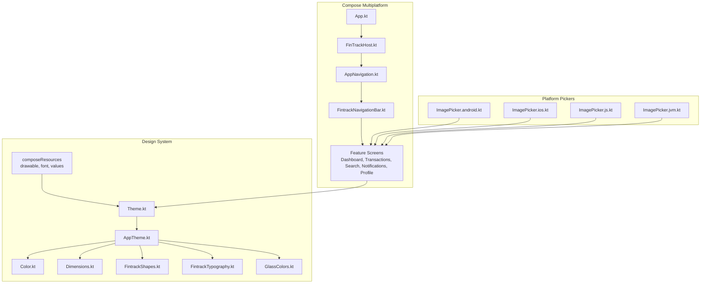

**Diagram sources**
- [App.kt](file://composeApp/src/commonMain/kotlin/com/kazemieh/composeApp/App.kt)
- [FinTrackHost.kt](file://composeApp/src/commonMain/kotlin/com/kazemieh/composeApp/FinTrackHost.kt)
- [AppNavigation.kt](file://composeApp/src/commonMain/kotlin/com/kazemieh/composeApp/navigation/AppNavigation.kt)
- [FintrackNavigationBar.kt](file://composeApp/src/commonMain/kotlin/com/kazemieh/composeApp/navigation/navigationBar/FintrackNavigationBar.kt)
- [Theme.kt](file://core/designsystem/src/commonMain/kotlin/com/kazemieh/designsystem/Theme.kt)
- [AppTheme.kt](file://core/designsystem/src/commonMain/kotlin/com/kazemieh/designsystem/AppTheme.kt)
- [Color.kt](file://core/designsystem/src/commonMain/kotlin/com/kazemieh/designsystem/Color.kt)
- [Dimensions.kt](file://core/designsystem/src/commonMain/kotlin/com/kazemieh/designsystem/Dimensions.kt)
- [FintrackShapes.kt](file://core/designsystem/src/commonMain/kotlin/com/kazemieh/designsystem/FintrackShapes.kt)
- [FintrackTypography.kt](file://core/designsystem/src/commonMain/kotlin/com/kazemieh/designsystem/FintrackTypography.kt)
- [GlassColors.kt](file://core/designsystem/src/commonMain/kotlin/com/kazemieh/designsystem/GlassColors.kt)
- [ImagePicker.android.kt](file://core/designsystem/src/androidMain/kotlin/com/kazemieh/designsystem/component/picker/ImagePicker.android.kt)
- [ImagePicker.ios.kt](file://core/designsystem/src/iosMain/kotlin/com/kazemieh/designsystem/component/picker/ImagePicker.ios.kt)
- [ImagePicker.js.kt](file://core/designsystem/src/jsMain/kotlin/com/kazemieh/designsystem/component/picker/ImagePicker.js.kt)
- [ImagePicker.jvm.kt](file://core/designsystem/src/jvmMain/kotlin/com/kazemieh/designsystem/component/picker/ImagePicker.jvm.kt)

**Section sources**
- [App.kt](file://composeApp/src/commonMain/kotlin/com/kazemieh/composeApp/App.kt)
- [FinTrackHost.kt](file://composeApp/src/commonMain/kotlin/com/kazemieh/composeApp/FinTrackHost.kt)
- [AppNavigation.kt](file://composeApp/src/commonMain/kotlin/com/kazemieh/composeApp/navigation/AppNavigation.kt)
- [FintrackNavigationBar.kt](file://composeApp/src/commonMain/kotlin/com/kazemieh/composeApp/navigation/navigationBar/FintrackNavigationBar.kt)
- [Theme.kt](file://core/designsystem/src/commonMain/kotlin/com/kazemieh/designsystem/Theme.kt)
- [AppTheme.kt](file://core/designsystem/src/commonMain/kotlin/com/kazemieh/designsystem/AppTheme.kt)
- [Color.kt](file://core/designsystem/src/commonMain/kotlin/com/kazemieh/designsystem/Color.kt)
- [Dimensions.kt](file://core/designsystem/src/commonMain/kotlin/com/kazemieh/designsystem/Dimensions.kt)
- [FintrackShapes.kt](file://core/designsystem/src/commonMain/kotlin/com/kazemieh/designsystem/FintrackShapes.kt)
- [FintrackTypography.kt](file://core/designsystem/src/commonMain/kotlin/com/kazemieh/designsystem/FintrackTypography.kt)
- [GlassColors.kt](file://core/designsystem/src/commonMain/kotlin/com/kazemieh/designsystem/GlassColors.kt)
- [ImagePicker.android.kt](file://core/designsystem/src/androidMain/kotlin/com/kazemieh/designsystem/component/picker/ImagePicker.android.kt)
- [ImagePicker.ios.kt](file://core/designsystem/src/iosMain/kotlin/com/kazemieh/designsystem/component/picker/ImagePicker.ios.kt)
- [ImagePicker.js.kt](file://core/designsystem/src/jsMain/kotlin/com/kazemieh/designsystem/component/picker/ImagePicker.js.kt)
- [ImagePicker.jvm.kt](file://core/designsystem/src/jvmMain/kotlin/com/kazemieh/designsystem/component/picker/ImagePicker.jvm.kt)

## Core Components
This section outlines the foundational building blocks of FinTrack’s design system and how they are applied across UI components.

- Theme and AppTheme
  - Defines the global Material 3-based theme, including dynamic color support, tonal palettes, and platform-specific adaptations.
  - Provides a unified entry point for applying theme tokens across screens and components.

- Color System
  - Centralizes brand and semantic colors, ensuring consistent usage across light/dark modes and platforms.
  - Supports tinting, surface colors, and contrast-aware variants.

- Dimensions and Shapes
  - Establishes spacing scales, corner radii, and elevation metrics aligned with Material 3.
  - Enables scalable sizing for paddings, margins, and component boundaries.

- Typography
  - Defines typographic scale and styles for labels, headings, and body text.
  - Ensures readability and hierarchy across devices and languages.

- Glassmorphism Colors
  - Offers backdrop blur-inspired color tokens and transparency effects for modern overlays and cards.
  - Balances aesthetics with accessibility by preserving sufficient contrast.

- Navigation Elements
  - Bottom navigation bar tailored for FinTrack’s primary flows.
  - Navigation composables integrate with destinations and screen routing.

- Form Components and Chips
  - Reusable form controls and chips are designed for consistent interaction patterns and state handling.
  - Integrated with validation and selection semantics.

- Platform Image Picker
  - Cross-platform image selection with platform-specific implementations for Android, iOS, JVM, and JS.

Usage examples and practical demonstrations are provided in later sections with code snippet paths to actual implementations.

**Section sources**
- [Theme.kt](file://core/designsystem/src/commonMain/kotlin/com/kazemieh/designsystem/Theme.kt)
- [AppTheme.kt](file://core/designsystem/src/commonMain/kotlin/com/kazemieh/designsystem/AppTheme.kt)
- [Color.kt](file://core/designsystem/src/commonMain/kotlin/com/kazemieh/designsystem/Color.kt)
- [Dimensions.kt](file://core/designsystem/src/commonMain/kotlin/com/kazemieh/designsystem/Dimensions.kt)
- [FintrackShapes.kt](file://core/designsystem/src/commonMain/kotlin/com/kazemieh/designsystem/FintrackShapes.kt)
- [FintrackTypography.kt](file://core/designsystem/src/commonMain/kotlin/com/kazemieh/designsystem/FintrackTypography.kt)
- [GlassColors.kt](file://core/designsystem/src/commonMain/kotlin/com/kazemieh/designsystem/GlassColors.kt)
- [BottombarNavigation.kt](file://composeApp/src/commonMain/kotlin/com/kazemieh/composeApp/navigation/navigationBar/BottombarNavigation.kt)
- [FintrackNavigationBar.kt](file://composeApp/src/commonMain/kotlin/com/kazemieh/composeApp/navigation/navigationBar/FintrackNavigationBar.kt)
- [ImagePicker.android.kt](file://core/designsystem/src/androidMain/kotlin/com/kazemieh/designsystem/component/picker/ImagePicker.android.kt)
- [ImagePicker.ios.kt](file://core/designsystem/src/iosMain/kotlin/com/kazemieh/designsystem/component/picker/ImagePicker.ios.kt)
- [ImagePicker.js.kt](file://core/designsystem/src/jsMain/kotlin/com/kazemieh/designsystem/component/picker/ImagePicker.js.kt)
- [ImagePicker.jvm.kt](file://core/designsystem/src/jvmMain/kotlin/com/kazemieh/designsystem/component/picker/ImagePicker.jvm.kt)

## Architecture Overview
The design system sits at the center of FinTrack’s UI architecture, providing theme tokens and reusable components. Compose multiplatform screens consume these tokens and components, while platform-specific pickers and resources are wired through generated resource accessors.

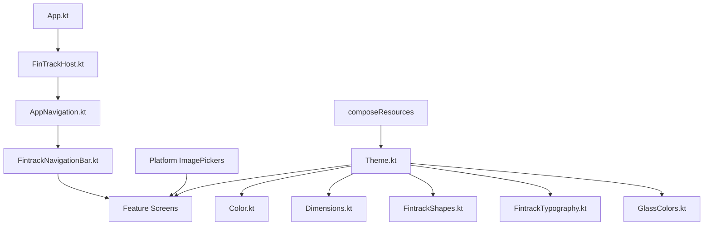

**Diagram sources**
- [Theme.kt](file://core/designsystem/src/commonMain/kotlin/com/kazemieh/designsystem/Theme.kt)
- [Color.kt](file://core/designsystem/src/commonMain/kotlin/com/kazemieh/designsystem/Color.kt)
- [Dimensions.kt](file://core/designsystem/src/commonMain/kotlin/com/kazemieh/designsystem/Dimensions.kt)
- [FintrackShapes.kt](file://core/designsystem/src/commonMain/kotlin/com/kazemieh/designsystem/FintrackShapes.kt)
- [FintrackTypography.kt](file://core/designsystem/src/commonMain/kotlin/com/kazemieh/designsystem/FintrackTypography.kt)
- [GlassColors.kt](file://core/designsystem/src/commonMain/kotlin/com/kazemieh/designsystem/GlassColors.kt)
- [App.kt](file://composeApp/src/commonMain/kotlin/com/kazemieh/composeApp/App.kt)
- [FinTrackHost.kt](file://composeApp/src/commonMain/kotlin/com/kazemieh/composeApp/FinTrackHost.kt)
- [AppNavigation.kt](file://composeApp/src/commonMain/kotlin/com/kazemieh/composeApp/navigation/AppNavigation.kt)
- [FintrackNavigationBar.kt](file://composeApp/src/commonMain/kotlin/com/kazemieh/composeApp/navigation/navigationBar/FintrackNavigationBar.kt)
- [ImagePicker.android.kt](file://core/designsystem/src/androidMain/kotlin/com/kazemieh/designsystem/component/picker/ImagePicker.android.kt)
- [ImagePicker.ios.kt](file://core/designsystem/src/iosMain/kotlin/com/kazemieh/designsystem/component/picker/ImagePicker.ios.kt)
- [ImagePicker.js.kt](file://core/designsystem/src/jsMain/kotlin/com/kazemieh/designsystem/component/picker/ImagePicker.js.kt)
- [ImagePicker.jvm.kt](file://core/designsystem/src/jvmMain/kotlin/com/kazemieh/designsystem/component/picker/ImagePicker.jvm.kt)

## Detailed Component Analysis

### Navigation Bar and Routing
The navigation bar integrates with the routing layer to provide primary navigation affordances. It consumes destination definitions and routes to appropriate screens.

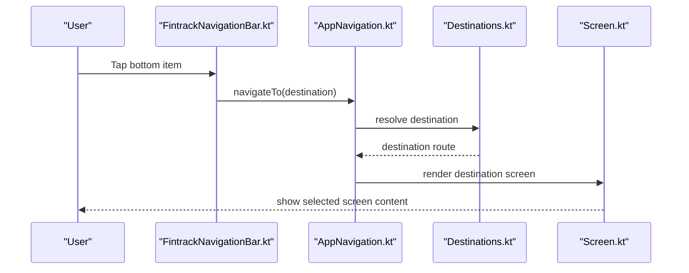

**Diagram sources**
- [FintrackNavigationBar.kt](file://composeApp/src/commonMain/kotlin/com/kazemieh/composeApp/navigation/navigationBar/FintrackNavigationBar.kt)
- [AppNavigation.kt](file://composeApp/src/commonMain/kotlin/com/kazemieh/composeApp/navigation/AppNavigation.kt)
- [Destinations.kt](file://composeApp/src/commonMain/kotlin/com/kazemieh/composeApp/navigation/Destinations.kt)
- [Screen.kt](file://composeApp/src/commonMain/kotlin/com/kazemieh/composeApp/navigation/Screen.kt)

**Section sources**
- [FintrackNavigationBar.kt](file://composeApp/src/commonMain/kotlin/com/kazemieh/composeApp/navigation/navigationBar/FintrackNavigationBar.kt)
- [AppNavigation.kt](file://composeApp/src/commonMain/kotlin/com/kazemieh/composeApp/navigation/AppNavigation.kt)
- [Destinations.kt](file://composeApp/src/commonMain/kotlin/com/kazemieh/composeApp/navigation/Destinations.kt)
- [Screen.kt](file://composeApp/src/commonMain/kotlin/com/kazemieh/composeApp/navigation/Screen.kt)

### Dashboard Widgets
Dashboard components demonstrate card-like layouts and quick actions, leveraging design system tokens for consistent spacing, typography, and color.

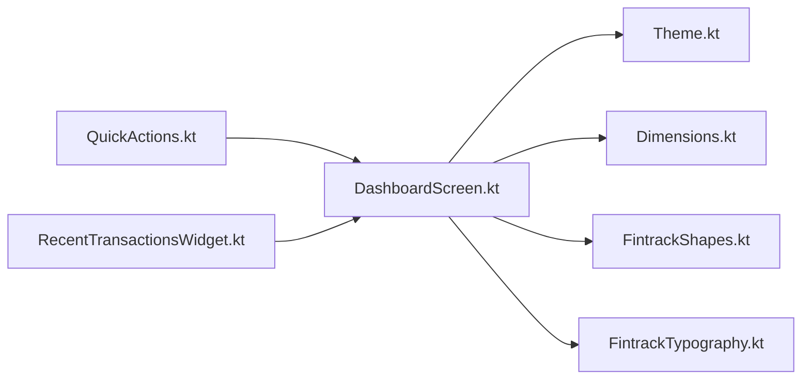

**Diagram sources**
- [QuickActions.kt](file://feature-container/dashboard/src/commonMain/kotlin/com/kazemieh/dashboard/component/QuickActions.kt)
- [RecentTransactionsWidget.kt](file://feature-container/dashboard/src/commonMain/kotlin/com/kazemieh/dashboard/component/RecentTransactionsWidget.kt)
- [DashboardScreen.kt](file://feature-container/dashboard/src/commonMain/kotlin/com/kazemieh/dashboard/DashboardScreen.kt)
- [Theme.kt](file://core/designsystem/src/commonMain/kotlin/com/kazemieh/designsystem/Theme.kt)
- [Dimensions.kt](file://core/designsystem/src/commonMain/kotlin/com/kazemieh/designsystem/Dimensions.kt)
- [FintrackShapes.kt](file://core/designsystem/src/commonMain/kotlin/com/kazemieh/designsystem/FintrackShapes.kt)
- [FintrackTypography.kt](file://core/designsystem/src/commonMain/kotlin/com/kazemieh/designsystem/FintrackTypography.kt)

**Section sources**
- [QuickActions.kt](file://feature-container/dashboard/src/commonMain/kotlin/com/kazemieh/dashboard/component/QuickActions.kt)
- [RecentTransactionsWidget.kt](file://feature-container/dashboard/src/commonMain/kotlin/com/kazemieh/dashboard/component/RecentTransactionsWidget.kt)
- [DashboardScreen.kt](file://feature-container/dashboard/src/commonMain/kotlin/com/kazemieh/dashboard/DashboardScreen.kt)

### Transactions Screens and Filters
Transactions screens showcase top bars, filters, and lists/cards. They integrate with the design system for consistent visuals and interactions.

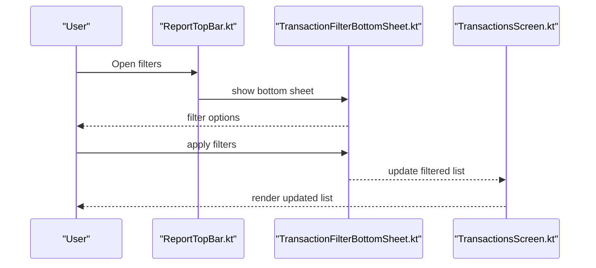

**Diagram sources**
- [ReportTopBar.kt](file://feature-container/transactions/src/commonMain/kotlin/com/kazemieh/transactions/ReportTopBar.kt)
- [TransactionFilterBottomSheet.kt](file://feature-container/transactions/src/commonMain/kotlin/com/kazemieh/transactions/TransactionFilterBottomSheet.kt)
- [TransactionsScreen.kt](file://feature-container/transactions/src/commonMain/kotlin/com/kazemieh/transactions/TransactionsScreen.kt)

**Section sources**
- [ReportTopBar.kt](file://feature-container/transactions/src/commonMain/kotlin/com/kazemieh/transactions/ReportTopBar.kt)
- [TransactionFilterBottomSheet.kt](file://feature-container/transactions/src/commonMain/kotlin/com/kazemieh/transactions/TransactionFilterBottomSheet.kt)
- [TransactionsScreen.kt](file://feature-container/transactions/src/commonMain/kotlin/com/kazemieh/transactions/TransactionsScreen.kt)

### Onboarding, Search, Notifications, and Profile
These screens illustrate form components, chips, and settings flows, all themed consistently through the design system.

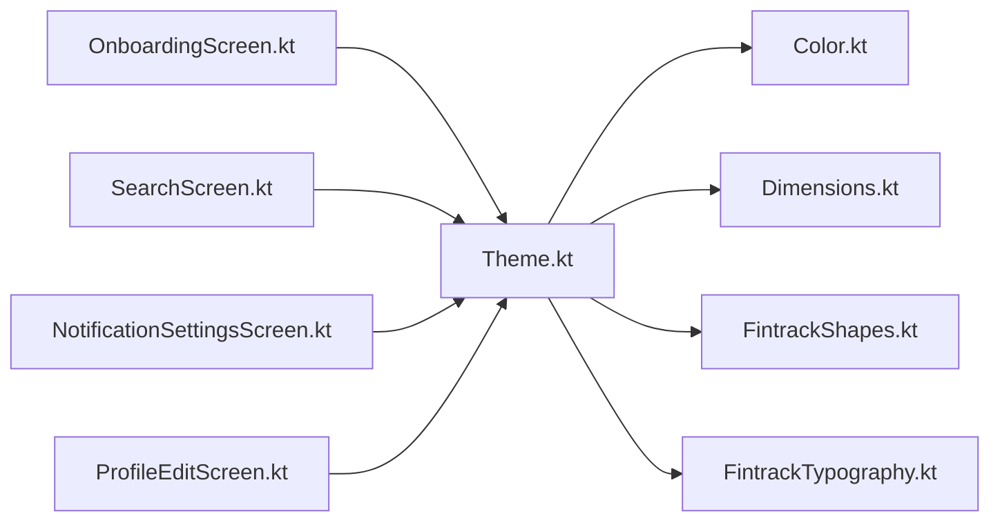

**Diagram sources**
- [OnboardingScreen.kt](file://feature-container/onboarding/src/commonMain/kotlin/com/kazemieh/onboarding/ui/OnboardingScreen.kt)
- [SearchScreen.kt](file://feature-container/search/src/commonMain/kotlin/com/kazemieh/search/ui/SearchScreen.kt)
- [NotificationSettingsScreen.kt](file://feature-container/notifications/src/commonMain/kotlin/com/kazemieh/notifications/ui/NotificationSettingsScreen.kt)
- [ProfileEditScreen.kt](file://feature-container/profile/src/commonMain/kotlin/com/kazemieh/profile/ProfileEditScreen.kt)
- [Theme.kt](file://core/designsystem/src/commonMain/kotlin/com/kazemieh/designsystem/Theme.kt)
- [Color.kt](file://core/designsystem/src/commonMain/kotlin/com/kazemieh/designsystem/Color.kt)
- [Dimensions.kt](file://core/designsystem/src/commonMain/kotlin/com/kazemieh/designsystem/Dimensions.kt)
- [FintrackShapes.kt](file://core/designsystem/src/commonMain/kotlin/com/kazemieh/designsystem/FintrackShapes.kt)
- [FintrackTypography.kt](file://core/designsystem/src/commonMain/kotlin/com/kazemieh/designsystem/FintrackTypography.kt)

**Section sources**
- [OnboardingScreen.kt](file://feature-container/onboarding/src/commonMain/kotlin/com/kazemieh/onboarding/ui/OnboardingScreen.kt)
- [SearchScreen.kt](file://feature-container/search/src/commonMain/kotlin/com/kazemieh/search/ui/SearchScreen.kt)
- [NotificationSettingsScreen.kt](file://feature-container/notifications/src/commonMain/kotlin/com/kazemieh/notifications/ui/NotificationSettingsScreen.kt)
- [ProfileEditScreen.kt](file://feature-container/profile/src/commonMain/kotlin/com/kazemieh/profile/ProfileEditScreen.kt)

### Glassmorphism Effects
Glassmorphism is achieved through translucent surfaces and backdrop blur-inspired tokens. These effects enhance depth perception while maintaining readability.

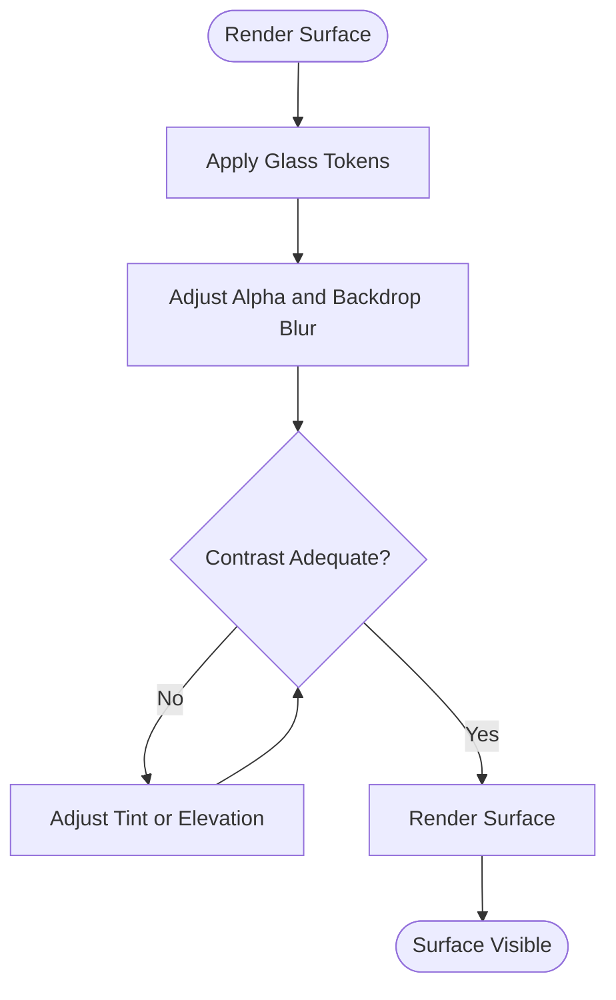

**Diagram sources**
- [GlassColors.kt](file://core/designsystem/src/commonMain/kotlin/com/kazemieh/designsystem/GlassColors.kt)
- [Theme.kt](file://core/designsystem/src/commonMain/kotlin/com/kazemieh/designsystem/Theme.kt)

**Section sources**
- [GlassColors.kt](file://core/designsystem/src/commonMain/kotlin/com/kazemieh/designsystem/GlassColors.kt)
- [Theme.kt](file://core/designsystem/src/commonMain/kotlin/com/kazemieh/designsystem/Theme.kt)

### Form Components and Chips
Form components and chips follow Material 3 semantics with consistent spacing, typography, and interaction states. They integrate with validation and selection patterns.

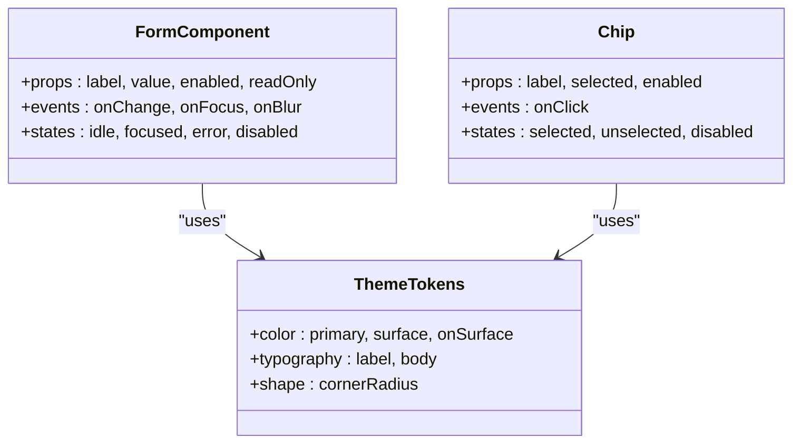

**Diagram sources**
- [Theme.kt](file://core/designsystem/src/commonMain/kotlin/com/kazemieh/designsystem/Theme.kt)
- [FintrackTypography.kt](file://core/designsystem/src/commonMain/kotlin/com/kazemieh/designsystem/FintrackTypography.kt)
- [FintrackShapes.kt](file://core/designsystem/src/commonMain/kotlin/com/kazemieh/designsystem/FintrackShapes.kt)
- [Color.kt](file://core/designsystem/src/commonMain/kotlin/com/kazemieh/designsystem/Color.kt)

**Section sources**
- [Theme.kt](file://core/designsystem/src/commonMain/kotlin/com/kazemieh/designsystem/Theme.kt)
- [FintrackTypography.kt](file://core/designsystem/src/commonMain/kotlin/com/kazemieh/designsystem/FintrackTypography.kt)
- [FintrackShapes.kt](file://core/designsystem/src/commonMain/kotlin/com/kazemieh/designsystem/FintrackShapes.kt)
- [Color.kt](file://core/designsystem/src/commonMain/kotlin/com/kazemieh/designsystem/Color.kt)

### Cards
Cards leverage shape, elevation, and typography tokens to present grouped content. They support interactive states and optional media overlays.

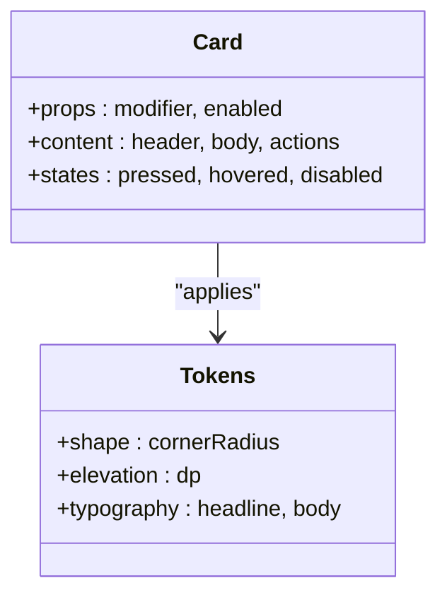

**Diagram sources**
- [FintrackShapes.kt](file://core/designsystem/src/commonMain/kotlin/com/kazemieh/designsystem/FintrackShapes.kt)
- [FintrackTypography.kt](file://core/designsystem/src/commonMain/kotlin/com/kazemieh/designsystem/FintrackTypography.kt)
- [Theme.kt](file://core/designsystem/src/commonMain/kotlin/com/kazemieh/designsystem/Theme.kt)

**Section sources**
- [FintrackShapes.kt](file://core/designsystem/src/commonMain/kotlin/com/kazemieh/designsystem/FintrackShapes.kt)
- [FintrackTypography.kt](file://core/designsystem/src/commonMain/kotlin/com/kazemieh/designsystem/FintrackTypography.kt)
- [Theme.kt](file://core/designsystem/src/commonMain/kotlin/com/kazemieh/designsystem/Theme.kt)

### Platform Image Picker
The image picker abstraction ensures consistent UX across platforms while delegating to native implementations.

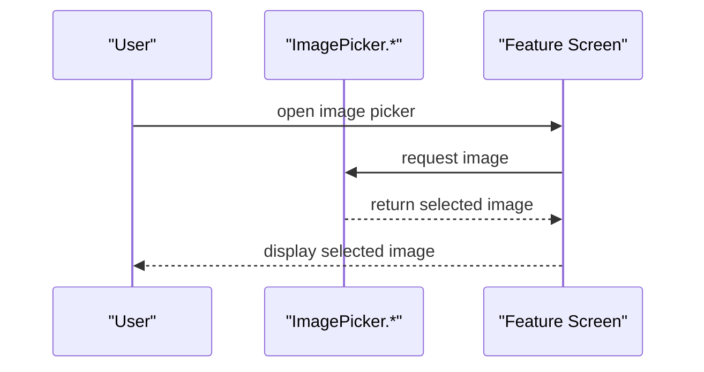

**Diagram sources**
- [ImagePicker.android.kt](file://core/designsystem/src/androidMain/kotlin/com/kazemieh/designsystem/component/picker/ImagePicker.android.kt)
- [ImagePicker.ios.kt](file://core/designsystem/src/iosMain/kotlin/com/kazemieh/designsystem/component/picker/ImagePicker.ios.kt)
- [ImagePicker.js.kt](file://core/designsystem/src/jsMain/kotlin/com/kazemieh/designsystem/component/picker/ImagePicker.js.kt)
- [ImagePicker.jvm.kt](file://core/designsystem/src/jvmMain/kotlin/com/kazemieh/designsystem/component/picker/ImagePicker.jvm.kt)

**Section sources**
- [ImagePicker.android.kt](file://core/designsystem/src/androidMain/kotlin/com/kazemieh/designsystem/component/picker/ImagePicker.android.kt)
- [ImagePicker.ios.kt](file://core/designsystem/src/iosMain/kotlin/com/kazemieh/designsystem/component/picker/ImagePicker.ios.kt)
- [ImagePicker.js.kt](file://core/designsystem/src/jsMain/kotlin/com/kazemieh/designsystem/component/picker/ImagePicker.js.kt)
- [ImagePicker.jvm.kt](file://core/designsystem/src/jvmMain/kotlin/com/kazemieh/designsystem/component/picker/ImagePicker.jvm.kt)

## Dependency Analysis
The design system is consumed by feature screens and navigation composable. Resource generation and platform pickers are decoupled via generated resource accessors and expect/actual abstractions.

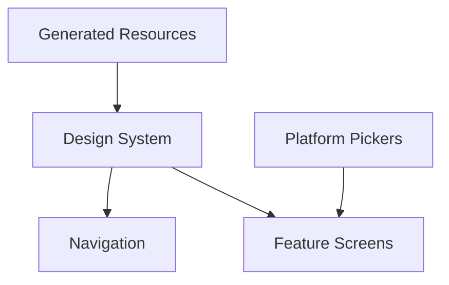

**Diagram sources**
- [Theme.kt](file://core/designsystem/src/commonMain/kotlin/com/kazemieh/designsystem/Theme.kt)
- [AppTheme.kt](file://core/designsystem/src/commonMain/kotlin/com/kazemieh/designsystem/AppTheme.kt)
- [FintrackNavigationBar.kt](file://composeApp/src/commonMain/kotlin/com/kazemieh/composeApp/navigation/navigationBar/FintrackNavigationBar.kt)
- [ImagePicker.android.kt](file://core/designsystem/src/androidMain/kotlin/com/kazemieh/designsystem/component/picker/ImagePicker.android.kt)
- [ImagePicker.ios.kt](file://core/designsystem/src/iosMain/kotlin/com/kazemieh/designsystem/component/picker/ImagePicker.ios.kt)
- [ImagePicker.js.kt](file://core/designsystem/src/jsMain/kotlin/com/kazemieh/designsystem/component/picker/ImagePicker.js.kt)
- [ImagePicker.jvm.kt](file://core/designsystem/src/jvmMain/kotlin/com/kazemieh/designsystem/component/picker/ImagePicker.jvm.kt)

**Section sources**
- [Theme.kt](file://core/designsystem/src/commonMain/kotlin/com/kazemieh/designsystem/Theme.kt)
- [AppTheme.kt](file://core/designsystem/src/commonMain/kotlin/com/kazemieh/designsystem/AppTheme.kt)
- [FintrackNavigationBar.kt](file://composeApp/src/commonMain/kotlin/com/kazemieh/composeApp/navigation/navigationBar/FintrackNavigationBar.kt)
- [ImagePicker.android.kt](file://core/designsystem/src/androidMain/kotlin/com/kazemieh/designsystem/component/picker/ImagePicker.android.kt)
- [ImagePicker.ios.kt](file://core/designsystem/src/iosMain/kotlin/com/kazemieh/designsystem/component/picker/ImagePicker.ios.kt)
- [ImagePicker.js.kt](file://core/designsystem/src/jsMain/kotlin/com/kazemieh/designsystem/component/picker/ImagePicker.js.kt)
- [ImagePicker.jvm.kt](file://core/designsystem/src/jvmMain/kotlin/com/kazemieh/designsystem/component/picker/ImagePicker.jvm.kt)

## Performance Considerations
- Prefer lazy composition and recomposition boundaries around heavy widgets (lists, grids).
- Use stable state hoisting to minimize unnecessary recompositions.
- Leverage density-independent units and scalable dimensions to avoid layout thrashing.
- Optimize image loading and caching for platform pickers.
- Keep animations subtle and hardware-accelerated for smooth UX.

## Troubleshooting Guide
- Theme not applied: Verify AppTheme is installed at the root of the app host and that resources are generated.
- Contrast issues with glass surfaces: Adjust alpha or tint tokens to meet accessibility thresholds.
- Navigation state mismatch: Ensure destinations and routes are consistent with AppNavigation and Destinations.
- Platform picker errors: Confirm platform-specific implementations are present and correctly wired.

**Section sources**
- [AppTheme.kt](file://core/designsystem/src/commonMain/kotlin/com/kazemieh/designsystem/AppTheme.kt)
- [GlassColors.kt](file://core/designsystem/src/commonMain/kotlin/com/kazemieh/designsystem/GlassColors.kt)
- [AppNavigation.kt](file://composeApp/src/commonMain/kotlin/com/kazemieh/composeApp/navigation/AppNavigation.kt)
- [Destinations.kt](file://composeApp/src/commonMain/kotlin/com/kazemieh/composeApp/navigation/Destinations.kt)
- [ImagePicker.android.kt](file://core/designsystem/src/androidMain/kotlin/com/kazemieh/designsystem/component/picker/ImagePicker.android.kt)
- [ImagePicker.ios.kt](file://core/designsystem/src/iosMain/kotlin/com/kazemieh/designsystem/component/picker/ImagePicker.ios.kt)
- [ImagePicker.js.kt](file://core/designsystem/src/jsMain/kotlin/com/kazemieh/designsystem/component/picker/ImagePicker.js.kt)
- [ImagePicker.jvm.kt](file://core/designsystem/src/jvmMain/kotlin/com/kazemieh/designsystem/component/picker/ImagePicker.jvm.kt)

## Conclusion
FinTrack’s design system provides a cohesive, Material 3-aligned foundation for UI components across platforms. By centralizing theme tokens, typography, shapes, colors, and glassmorphism effects, the system ensures consistent visuals, accessible interactions, and maintainable composition patterns. Navigation, forms, chips, cards, and platform pickers all benefit from this shared library, enabling rapid development and cross-platform consistency.

## Appendices

### Responsive Design Guidelines
- Use scalable dimensions and adaptive layouts for varying screen sizes.
- Ensure touch targets meet minimum size requirements across densities.
- Test typography scaling and line heights on small/large displays.

### Accessibility Compliance
- Maintain sufficient color contrast in both light and dark modes.
- Provide focus indicators and keyboard navigation support.
- Announce state changes and selections for assistive technologies.

### Cross-Platform Consistency
- Share design tokens and component definitions via commonMain.
- Implement platform-specific pickers and integrations using expect/actual.
- Align animations and transitions with platform motion guidelines.

### Theming Support and Color System Integration
- Define primary, secondary, tertiary, surface, and error palettes.
- Use semantic roles for backgrounds, content, and interactive elements.
- Enable dynamic color on supported platforms and fallback gracefully.

### Usage Examples (Code Snippet Paths)
- Navigation: [FintrackNavigationBar.kt](file://composeApp/src/commonMain/kotlin/com/kazemieh/composeApp/navigation/navigationBar/FintrackNavigationBar.kt), [AppNavigation.kt](file://composeApp/src/commonMain/kotlin/com/kazemieh/composeApp/navigation/AppNavigation.kt)
- Dashboard: [DashboardScreen.kt](file://feature-container/dashboard/src/commonMain/kotlin/com/kazemieh/dashboard/DashboardScreen.kt), [QuickActions.kt](file://feature-container/dashboard/src/commonMain/kotlin/com/kazemieh/dashboard/component/QuickActions.kt), [RecentTransactionsWidget.kt](file://feature-container/dashboard/src/commonMain/kotlin/com/kazemieh/dashboard/component/RecentTransactionsWidget.kt)
- Transactions: [TransactionsScreen.kt](file://feature-container/transactions/src/commonMain/kotlin/com/kazemieh/transactions/TransactionsScreen.kt), [ReportTopBar.kt](file://feature-container/transactions/src/commonMain/kotlin/com/kazemieh/transactions/ReportTopBar.kt), [TransactionFilterBottomSheet.kt](file://feature-container/transactions/src/commonMain/kotlin/com/kazemieh/transactions/TransactionFilterBottomSheet.kt)
- Onboarding: [OnboardingScreen.kt](file://feature-container/onboarding/src/commonMain/kotlin/com/kazemieh/onboarding/ui/OnboardingScreen.kt)
- Search: [SearchScreen.kt](file://feature-container/search/src/commonMain/kotlin/com/kazemieh/search/ui/SearchScreen.kt)
- Notifications: [NotificationSettingsScreen.kt](file://feature-container/notifications/src/commonMain/kotlin/com/kazemieh/notifications/ui/NotificationSettingsScreen.kt)
- Profile: [ProfileEditScreen.kt](file://feature-container/profile/src/commonMain/kotlin/com/kazemieh/profile/ProfileEditScreen.kt), [ThemeAndCurrencyScreen.kt](file://feature-container/profile/src/commonMain/kotlin/com/kazemieh/profile/ThemeAndCurrencyScreen.kt)
- Platform Picker: [ImagePicker.android.kt](file://core/designsystem/src/androidMain/kotlin/com/kazemieh/designsystem/component/picker/ImagePicker.android.kt), [ImagePicker.ios.kt](file://core/designsystem/src/iosMain/kotlin/com/kazemieh/designsystem/component/picker/ImagePicker.ios.kt), [ImagePicker.js.kt](file://core/designsystem/src/jsMain/kotlin/com/kazemieh/designsystem/component/picker/ImagePicker.js.kt), [ImagePicker.jvm.kt](file://core/designsystem/src/jvmMain/kotlin/com/kazemieh/designsystem/component/picker/ImagePicker.jvm.kt)

### Additional Context
- Calendar and Money Formatting: [JalaliCalendar.kt](file://core/jalali/src/commonMain/kotlin/com/kazemieh/jalali/JalaliCalendar.kt), [MoneyFormatter.kt](file://core/money/src/commonMain/kotlin/com/kazemieh/money/MoneyFormatter.kt)
- Preferences: [FinTrackPreferences.kt](file://core/preferences/src/commonMain/kotlin/com/kazemieh/preferences/FinTrackPreferences.kt)
- Android Resources: [colors.xml](file://app/src/main/res/values/colors.xml), [themes.xml](file://app/src/main/res/values/themes.xml), [strings.xml](file://app/src/main/res/values/strings.xml), [settings.xml](file://app/src/main/res/values/settings.xml)