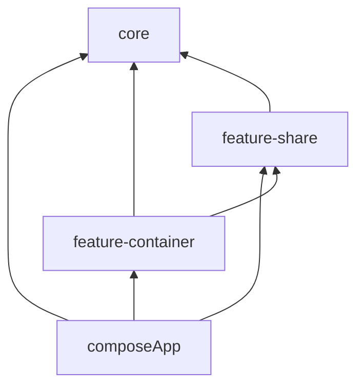

# Module dependency summary

This summary covers the combined Graphify corpus: `core`, `feature-share`,
`feature-container`, and `composeApp`.

## Dependency direction

## Declared Gradle project dependencies

| Source group | Target group | Count |
|---|---:|---:|
| `composeApp` | `core` | 9 |
| `composeApp` | `feature-container` | 5 |
| `composeApp` | `feature-share` | 23 |
| `feature-container` | `core` | 24 |
| `feature-container` | `feature-share` | 31 |
| `feature-share` | `core` | 97 |
| `core` | `core` | 18 |
| `feature-share` | `feature-share` | 28 |

## Interpretation

- `composeApp` is the composition root: it assembles core infrastructure, all
  feature containers, and the shared feature modules.
- `feature-container` modules orchestrate screens and depend on shared feature
  modules plus core services.
- `feature-share` holds reusable feature flows and is mostly built on `core`;
  it also has intentional feature-to-feature relationships (for example,
  transaction-related flows use source, category, tags, and person).
- `core` is internally layered: common utilities and models underpin domain;
  data builds on domain and contracts; database implements data contracts.

## Combined Graphify output

- 4,711 nodes
- 6,712 edges
- 428 communities
- Extraction is code-only; no external LLM/API was used.

Graph health: no missing or dangling endpoints and no endpoint-edge collapse.
Three self-loop edges were detected; these are retained in the graph.
